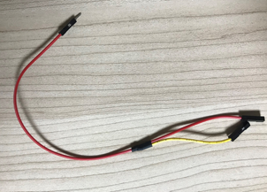

# APDS-9930 - デジタル照度/近接センサー

APDS-9930 は、デジタル I2C 互換インタフェース照度センサ (ALS) と近接センサを IR LED と共に 1 つの 8 ピン・パッケージに組み込んでいます。照度センサは、2 個のフォトダイオードを用いて 0.01lux の低ルクス性能を持つ人間の目の感度に近づけています。この高感度により、デバイスは濃い色のガラスを通して動作することができます。近接センサは、100mm 以内の物体を検出するように完全較正 (キャリブレーション) され、したがって最終装置またはサブアセンブリの工場出荷時の較正 (キャリブレーション) が不要です。近接検出機能は、明るい日光の下から暗い部屋まで適切に働きます。モジュール内に追加された微小光学レンズが、赤外線エネルギーを透過し受け取る効率を高め、全体の消費電力を減少させます。さらに、内部状態機械が、デバイスを ALS 測定と接近測定間で低消費電力モードにし、平均電力消費をきわめて少なくすることができます。

[APDS-9930-デジタル照度/近接センサー](https://jp.broadcom.com/products/optical-sensors/integrated-ambient-light-proximity-sensors/apds-9930)より

## SpresenseメインボードとAPDS-9930の接続

SpresenseメインボードとAPDS-9930を接続するときは、ピンヘッダをはんだ付けして接続します。

SpresenseメインボードとAPDS-9930とのピンの接続は表のようになります。

|Spresenseメインボード|APDS-9930-デジタル照度/近接センサー|
|----|----|
|GND| GND |
|3.3V|VCC |
|3.3V|VL|
|I2C SCL|SCL|
|I2C SDA|SDA|

なお、接近センサーを使用する際には、VL (赤外線LED電源)を3.3Vに接続しないと、近接のデータが取得できません。
電源ジャンパーとVLジャンパーをショートしてSpresenseメインボードの3.3Vに接続するなどしてください。

Spresenseメインボードの接続先については、Spresenseメインボードのピンレイアウト図を参考にしてください。

[Spresenseメインボード](https://developer.sony.com/develop/spresense/docs/introduction_ja.html#_spresense_%E3%83%A1%E3%82%A4%E3%83%B3%E3%83%9C%E3%83%BC%E3%83%89)より

## 参考情報

- [APDS-9930](https://jp.broadcom.com/products/optical-sensors/integrated-ambient-light-proximity-sensors/apds-9930)
- [datasheet](https://www.mouser.jp/datasheet/2/678/av02-3190en_ds_apds-9930_2015-11-13-1828481.pdf)
- [近接センサー参考情報](docs/APDS-9930_Summary.pdf)

## サンプルプログラム
- [照度サンプルプログラム](https://github.com/sonydevworld/spresense/tree/master/examples/light)
- [近接検出サンプルプログラム](https://github.com/sonydevworld/spresense/tree/master/examples/proximity)
