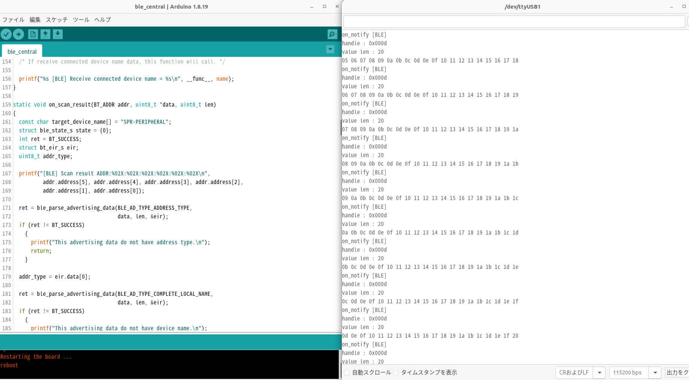
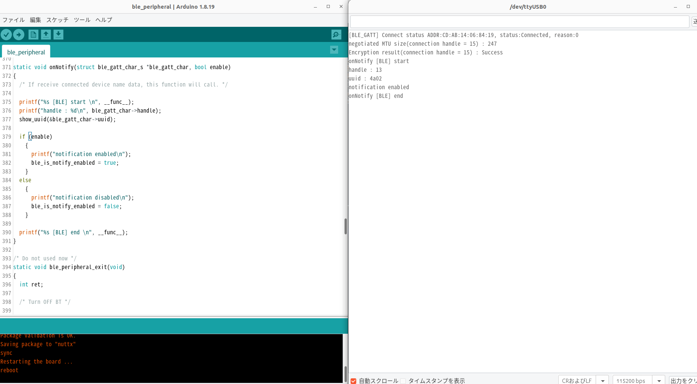

# BLE1507サンプルプログラム

本サンプルは、 [BLE1507 (BLE for Spresense)](https://crane-elec.co.jp/products/vol-24/)を使用して、ペリフェラルからセントラルにデータ送信するサンプルとなります。
1. まずセントラルのサンプルをビルドして起動します。
2. セントラルはTargetデバイス：SPR-PERIPHERALを見つけるまでスキャンします。
3. 次はペリフェラルのサンプルをビルドして起動します。
4. そうすると、セントラルはSPR-PERIPHERALという名前のペリフェラルデバイスと接続していきます。
5. ペリフェラルからデータをセントラルに送り続きます。
6. ※セントラルからペリフェラルへデータ送信する場合、ble_characteristic_write() APIを使って簡単に実現できます。
   1. 簡単の例として、[ble_central.ino](https://github.com/TomonobuHayakawa/Spresense-Playground/blob/master/ForHandsOn/BLE/ble_central/ble_central.ino#L410)のon_notify()最後に下記のコードを追加します。
   2. <pre>ble_characteristic_write(0, ble_gatt_char, NULL, 0);</pre>
   3. そうすると、セントラルは受信したデータをそのままペリフェラルへ返すようになります。実際実行した様子のログは[双方向動作例](#双方向動作例)をご参照ください。
   4. ※実際どのデータを送信するか、アプリケーションで修正してみてください。

## 動作確認したときの環境

### 開発環境
- PC: Ubuntu 22.04
- Arduino IDE:v1.8.19
- Spresense Arduino:v3.1.0

### 使用デバイス
- Spresense Main Board(2台)
- BLE1507 (BLE for Spresense)(2台)

### ライブラリ
- 特になし

## 事前準備
- [Spresense Arduino スタートガイド](https://developer.sony.com/develop/spresense/docs/arduino_set_up_ja.html)に記載の手順に従って環境を構築します。なお、Spresense Arduino環境インストール済みの場合は実施不要です。
- ペリフェラルとセントラルをそれぞれ1台用意します。

## ビルド方法
1. [Arduinoソースコードビルド方法](https://developer.sony.com/develop/spresense/docs/arduino_set_up_ja.html#_led_%E3%81%AE%E3%82%B9%E3%82%B1%E3%83%83%E3%83%81%E3%82%92%E5%8B%95%E3%81%8B%E3%81%97%E3%81%A6%E3%81%BF%E3%82%8B)を参照して、
セントラルに対して、[ble_central.ino](https://github.com/TomonobuHayakawa/Spresense-Playground/tree/master/ForHandsOn/BLE/ble_central/ble_central.ino)をArduino IDEで開いてマイコンボードに書き込む ボタンをクリックして、スケッチのコンパイルと書き込みを行います。
2. ペリフェラルに対して、[ble_peripheral.ino](https://github.com/TomonobuHayakawa/Spresense-Playground/tree/master/ForHandsOn/BLE/ble_peripheral/ble_peripheral.ino)をArduino IDEで開いてマイコンボードに書き込む ボタンをクリックして、スケッチのコンパイルと書き込みを行います。
3. スケッチの書き込みが完了するまで待ちます。
4. スケッチの書き込みが完了すると自動的にリセットしてプログラムが起動します。

## サンプルプログラム

### 動作例
|セントラルサンプルのシリアルモニタを開く|
|----|
||
|ペリフェラルサンプルのシリアルモニタを開く|
|----|
||

### 双方向動作例
<pre>
セントラル動作確認ログ：
[BLE] Scan result ADDR:CD:AB:14:06:84:19
[BLE] Scan device name: SPR-PERIPHERAL
...
Encryption result(connection handle = 0) : Success
on_descriptor_write [BLE] conn_handle = 0x0000, handle = 0x000e, result = 0
on_write [BLE] data[0] = 0x74, Length = 0
on_notify [BLE]
handle : 0x000d
value len : 20
0d 0e 0f 10 11 12 13 14 15 16 17 18 19 1a 1b 1c 1d 1e 1f 20　/*ペリフェラルから通知してきたデータ*/
ーーーーーーーーーーーーーーーーーーーーーーーーーーーーーーーーーーーーーーーーーーーーーーーーーーーーーー
ペリフェラル動作確認ログ：
[BLE_GATT] Connect status ADDR:CD:AB:14:06:84:19, status:Connected, reason:0
negotiated MTU size(connection handle = 15) : 247
Encryption result(connection handle = 15) : Success
...
onWrite [BLE] start
handle : 13
uuid : 4a02
value_len : 20
value : 0c 0d 0e 0f 10 11 12 13 14 15 16 17 18 19 1a 1b 1c 1d 1e 1f 　/*セントラルから受信したデータ*/
onWrite [BLE] end
</pre>

### 操作方法
特に不要。

### 確認方法
- Arduino IDEのシリアルモニタでログをご参照ください。

## 参考ページ
- [BLE1507 (BLE for Spresense)](https://crane-elec.co.jp/products/vol-24/)
- [BLEサンプルプログラム](https://github.com/TomonobuHayakawa/Spresense-Playground/tree/master/ForHandsOn/BLE)

## 変更履歴
|リリース日|変更点|
|----|----|
|2023/08/10|初版|
