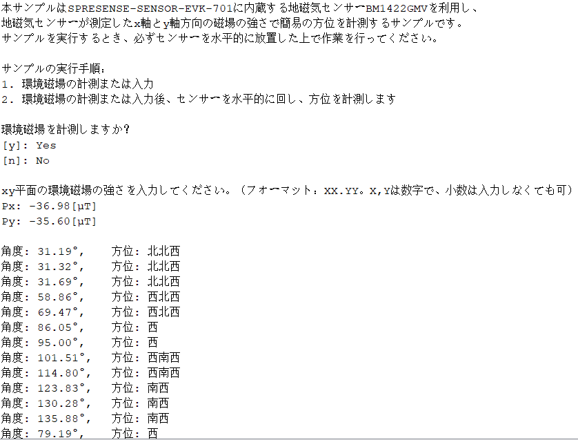
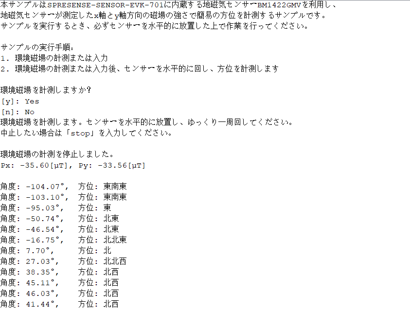

# 地磁気センサーによる方位計測サンプルプログラム

本サンプルはSPRESENSE-SENSOR-EVK-701に内蔵するBM1422AGMV地磁気センサーを利用し、地磁気センサーが測定したX軸とY軸方向の磁場の強さで簡易の方位を計測するサンプルです。

## 動作確認したときの環境

### 開発環境
- PC: Ubuntu 18.04 または Windows 11
- Arduino IDE v1.8.13
- Spresense Arduino:v2.6.0

### 使用デバイス
- Spresense Main Board
- SPRESENSE-SENSOR-EVK-701

### ライブラリ
- [BM1422AGMV library](https://github.com/RohmSemiconductor/Arduino/tree/master/BM1422AGMV)

## 事前準備
- [Spresense Arduino スタートガイド](https://developer.sony.com/develop/spresense/docs/arduino_set_up_ja.html)に記載の手順に従って環境を構築します。なお、Spresense Arduino環境インストール済みの場合は実施不要です。
- [BM1422AGMV library](https://github.com/RohmSemiconductor/Arduino/tree/master/BM1422AGMV)をインストールします。Spresense Arduinoライブラリのインストール方法は[こちら](https://github.com/SonySemiconductorSolutions/ssup-spresense-internal/blob/main/FAQ.md#arduino%E3%83%A9%E3%82%A4%E3%83%96%E3%83%A9%E3%83%AA%E3%82%92%E3%82%A4%E3%83%B3%E3%82%B9%E3%83%88%E3%83%BC%E3%83%AB%E3%81%99%E3%82%8B%E6%96%B9%E6%B3%95)をご参照ください。既にインストール済みの場合は実施不要です。

## ビルド方法
1. [Arduinoソースコードビルド方法](https://developer.sony.com/develop/spresense/docs/arduino_set_up_ja.html#_led_%E3%81%AE%E3%82%B9%E3%82%B1%E3%83%83%E3%83%81%E3%82%92%E5%8B%95%E3%81%8B%E3%81%97%E3%81%A6%E3%81%BF%E3%82%8B)を参照して、[BM1422AGMV.ino](./BM1422AGMV.ino)をArduino IDEで開いてマイコンボードに書き込む ボタンをクリックして、スケッチのコンパイルと書き込みを行います。
2. スケッチの書き込みが完了するまで待ちます。
3. スケッチの書き込みが完了すると自動的にリセットしてプログラムが起動します。

## サンプルプログラム

### 動作例
|環境磁場を入力する場合|環境磁場を計測する場合|
|----|----|
|||

## 参考ページ
- [Spresense Arduino スタートガイド](https://developer.sony.com/develop/spresense/docs/arduino_set_up_ja.html)

## 変更履歴
|リリース日|変更点|
|----|----|
|2022/12/09|初版|
|2022/12/20|ドキュメント・コメントアウトフォーマット修正|
