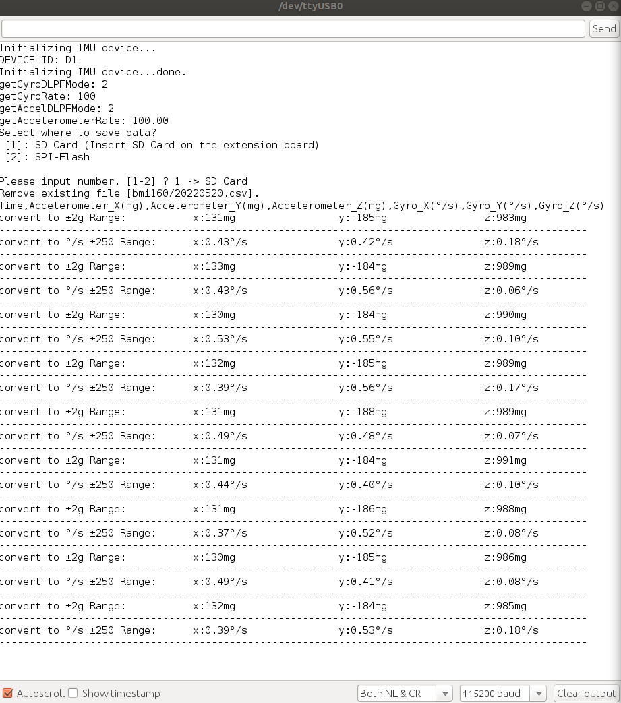
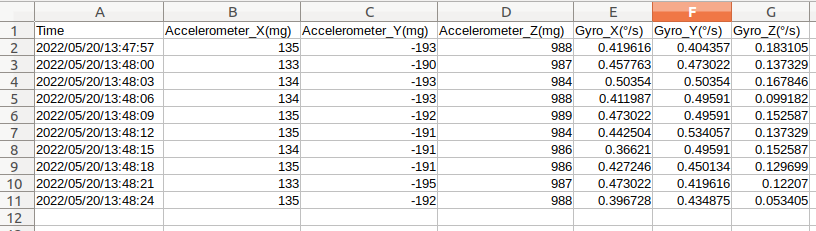

# BMI160サンプルプログラム

BMI160センサーから3軸加速度や3軸ジャイロのデータを取得して、FlashメモリやSDカードにcsvの形式で保存するサンプルプログラムとなります。データ取得間隔は秒単位で設定できます。

## 動作を確認したときの環境

### 開発環境
- PC : Ubuntu 18.04 または Windows 10
- Arduino IDE:v1.8.13
- Spresense Arduino v2.6.0

### 使用デバイス
- Spresense Main Board
- BMI160

### ライブラリ
- [BMI160 library](https://github.com/kzhioki/BMI160-Arduino)

## 事前準備
- [Spresense Arduino スタートガイド](https://developer.sony.com/develop/spresense/docs/arduino_set_up_ja.html)に記載の手順に従って環境を構築します。なお、Spresense Arduino環境インストール済みの場合は実施不要です。
- [BMI160 library](https://github.com/kzhioki/BMI160-Arduino)をインストールします。Spresense Arduinoライブラリのインストール方法は[こちら](https://github.com/SonySemiconductorSolutions/ssup-spresense-internal/blob/main/FAQ.md#arduino%E3%83%A9%E3%82%A4%E3%83%96%E3%83%A9%E3%83%AA%E3%82%92%E3%82%A4%E3%83%B3%E3%82%B9%E3%83%88%E3%83%BC%E3%83%AB%E3%81%99%E3%82%8B%E6%96%B9%E6%B3%95)をご参照ください。既にインストール済みの場合は実施不要です。

## ビルド方法
1. [Arduinoソースコードビルド方法](https://developer.sony.com/develop/spresense/docs/arduino_set_up_ja.html#_led_%E3%81%AE%E3%82%B9%E3%82%B1%E3%83%83%E3%83%81%E3%82%92%E5%8B%95%E3%81%8B%E3%81%97%E3%81%A6%E3%81%BF%E3%82%8B)を参照して、[BMI160.ino](./BMI160.ino)をArduino IDEで開いてマイコンボードに書き込む ボタンをクリックして、スケッチのコンパイルと書き込みを行います。
2. スケッチの書き込みが完了するまで待ちます。
3. スケッチの書き込みが完了すると自動的にリセットしてプログラムが起動します。

## サンプルプログラム

### 動作例

|Time|Accelerometer_X(mg)|Accelerometer_Y(mg)|Accelerometer_Z(mg)|Gyro_X(°/s)|Gyro_Y(°/s)|Gyro_Z(°/s)|
|----|----|----|----|----|----|----|
|2022/05/20/13:47:57|135|-193|988|0.419616|0.404357|0.183105|
|2022/05/20/13:48:00|133|-190|987|0.457763|0.473022|0.137329|
|2022/05/20/13:48:03|134|-193|984|0.50354|0.50354|0.167846|

### 使用方法
Arduino IDEのシリアルモニタを開いて、データをどちらに保存するかを選択して、Enterキーを押すだけです。

|シリアルモニタを開く|保存場所を選択する|csvファイルを確認する|
|----|----|----|
||||

(注1)起動するとデータのファイル書き込みが続きます。終了するには[Spresenseの[RST] Reset button](https://developer.sony.com/develop/spresense/docs/introduction_ja.html)を押してください。 
(注2)データを取得再開する場合、前のファイルを上書きするため、ファイルをバックアップしてからデータを取得してください。

### 操作方法
Arduino IDEのシリアルモニタを開いている状態で、以下のキーを入力することで操作が可能
|入力キー|動作|
|----|----|
|1＋Enterキー|データをSDカードに保存する|
|2＋Enterキー|データをFlashメモリに保存する|

### FlashメモリとSDカード共通の確認方法
[Zmodem を使ってPCにファイル転送](https://developer.sony.com/develop/spresense/docs/sdk_tutorials_ja.html#_tips_zmodem)に記載の手順に従ってファイルをPCで確認できます。

### SDカードのみの確認方法
手動でSDカードをPCに差し込み確認できます。

## 変更履歴
|リリース日|変更点|
|----|----|
|2022/05/20|初版|
|2022/12/16|コメントアウトフォーマット修正|
