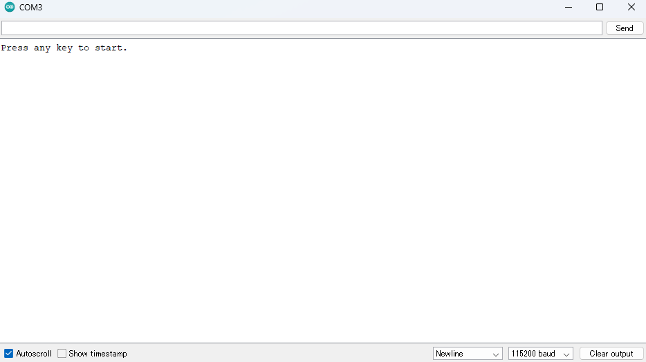

<div align="right">
<a href="https://developer.sony.com/ja/develop/ssup/"></a>
</div>

# BMI270のサンプルプログラム

BMI270センサーから3軸加速度や3軸ジャイロのデータを取得して、シリアルモニタに表示します。BMI160からBMI270へ移植するための参考用サンプルプログラムにもなります。

## 動作確認したときの環境

### 開発環境
  - PC: Ubuntu 18.04 または Windows 11
  - Arduino IDE v1.8.13
  - Spresense Arduino v2.6.0

### 使用デバイス
- Spresense Main Board
- BMI270

### ライブラリ
- [BMI270 library](https://github.com/TomonobuHayakawa/BMI270-Sensor-API)

## 事前準備
- [Spresense Arduino スタートガイド](https://developer.sony.com/develop/spresense/docs/arduino_set_up_ja.html)に記載の手順に従って環境を構築します。なお、Spresense Arduino環境インストール済みの場合は実施不要です。
- [BMI270 library](https://github.com/TomonobuHayakawa/BMI270-Sensor-API)をインストールします。Spresense Arduinoライブラリのインストール方法は[こちら](https://github.com/SonySemiconductorSolutions/ssup-spresense-internal/blob/main/FAQ.md#arduino%E3%83%A9%E3%82%A4%E3%83%96%E3%83%A9%E3%83%AA%E3%82%92%E3%82%A4%E3%83%B3%E3%82%B9%E3%83%88%E3%83%BC%E3%83%AB%E3%81%99%E3%82%8B%E6%96%B9%E6%B3%95)をご参照ください。既にインストール済みの場合は実施不要です。

## ビルド方法
1. [Arduinoソースコードビルド方法](https://developer.sony.com/develop/spresense/docs/arduino_set_up_ja.html#_led_%E3%81%AE%E3%82%B9%E3%82%B1%E3%83%83%E3%83%81%E3%82%92%E5%8B%95%E3%81%8B%E3%81%97%E3%81%A6%E3%81%BF%E3%82%8B)を参照して、[BMI160_transplant_to_BMI270_1202.ino](./BMI160_transplant_to_BMI270_1202.ino)をArduino IDEで開いてマイコンボードに書き込む ボタンをクリックして、スケッチのコンパイルと書き込みを行います。
2. スケッチの書き込みが完了するまで待ちます。
3. スケッチの書き込みが完了すると自動的にリセットしてプログラムが起動します。

## サンプルプログラム

### 使用方法
Arduino IDEのシリアルモニタを開いて、任意文字を入力し、Enterキーを押すだけです。

|シリアルモニタを開く|
|----|
||

(注1)起動するとデータの取得が続きます。終了するには[Spresenseの[RST] Reset button](https://developer.sony.com/develop/spresense/docs/introduction_ja.html)を押してください。<br/>

### 操作方法
Arduino IDEのシリアルモニタを開いている状態で、以下のキーを入力することで操作が可能：
|入力キー|動作|
|----|----|
|任意文字|データ取得を開始する|

### 確認方法
シリアルモニタでデータが表示されたかを確認する

### 動作例
aには加速度センサーの値、gにはジャイロセンサーの値が表示されます。

```
Press any key to start.  
a:	0.13	-0.13	9.70		g:	-0.03	0.05	-0.10  
a:	0.12	-0.15	9.69		g:	-0.03	0.06	-0.08  
a:	0.12	-0.14	9.72		g:	-0.03	0.05	-0.08  
```

## 変更履歴
|リリース日|変更点|
|----|----|
|2022/12/19|初版|
