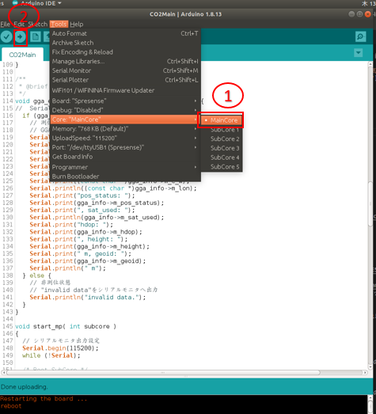
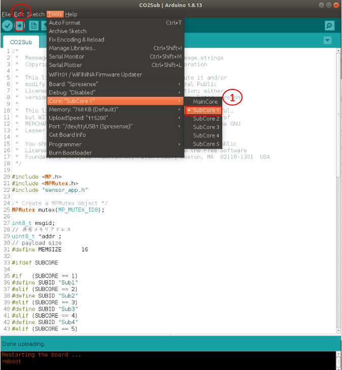
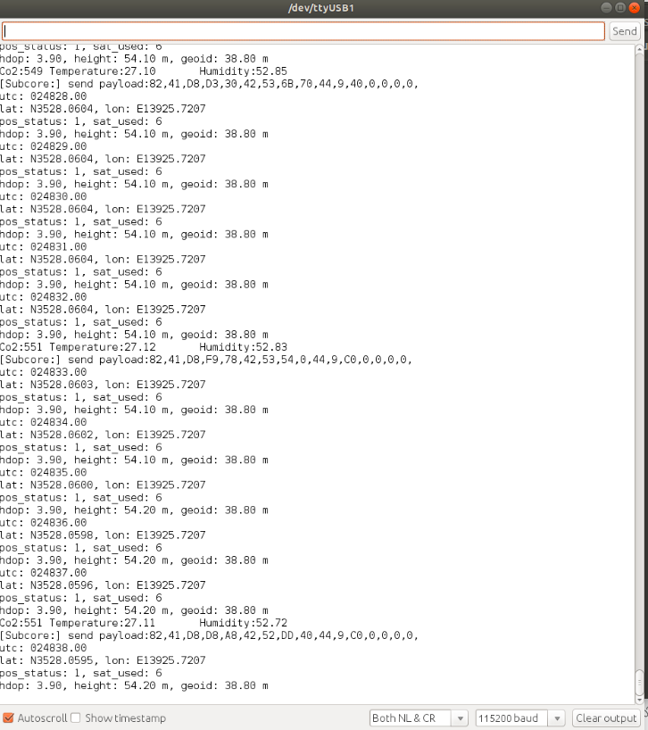
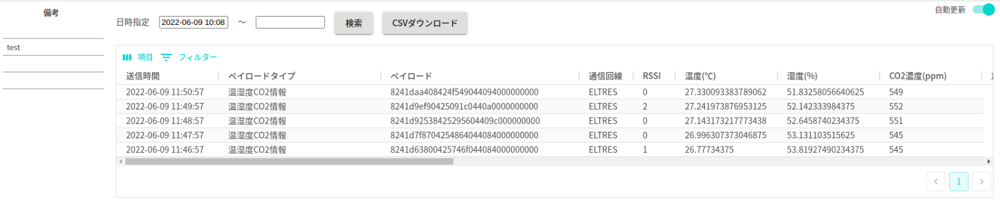
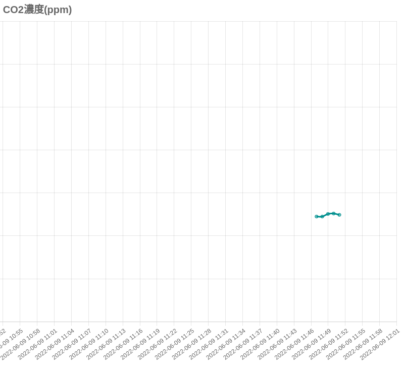
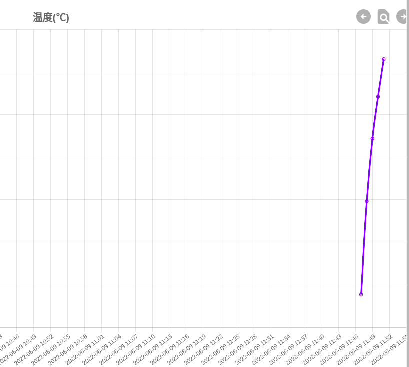
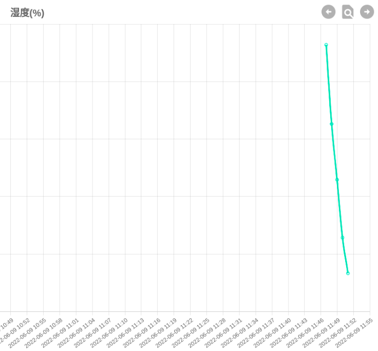

# SPRESENSE用ELTRESアドオンボード

SPRESENSE用ELTRESアドオンボードを使って、様々なセンサーから取得したデータをELTRES通信によりCLIP Viewer Lite サーバーに送信するサンプルとなります。
本サンプルはCO2濃度、温湿度情報をトータル5回で、1分ごとにCLIP Viewer Lite サーバーに送信するとなっています。なお、本サンプルはMultiCoreで実装しています。

## 動作確認したときの環境

### 開発環境
- PC: Ubuntu 18.04
- Arduino IDE:v1.8.13
- Spresense Arduino:v2.6.0

### 使用デバイス
- Spresense Main Board
- Spresense 用 CO2センサー Add-on ボード
- ELTRES Add-onボード

### ライブラリ
- [CO2 library](https://github.com/Sensirion/arduino-i2c-scd4x.git)

## 事前準備
- ELTRESアドオンボード用のライブラリをインストールします。取扱説明書およびライブラリのダウンロードは[こちら](https://www.cresco-dt.co.jp/service/iot/iot-poc/eltres/)への登録が必要になります。なお、ELTRESアドオンボード用のライブラリをインストール済みの場合は実施不要です。

- [Spresense Arduino スタートガイド](https://developer.sony.com/develop/spresense/docs/arduino_set_up_ja.html)に記載の手順に従って環境を構築します。なお、Spresense Arduino環境インストール済みの場合は実施不要です。

- [CO2 library](https://github.com/Sensirion/arduino-i2c-scd4x.git)をインストールします。Spresense Arduinoライブラリのインストール方法は[こちら](https://github.com/SonySemiconductorSolutions/ssup-spresense-internal/blob/main/FAQ.md#arduino%E3%83%A9%E3%82%A4%E3%83%96%E3%83%A9%E3%83%AA%E3%82%92%E3%82%A4%E3%83%B3%E3%82%B9%E3%83%88%E3%83%BC%E3%83%AB%E3%81%99%E3%82%8B%E6%96%B9%E6%B3%95)をご参照ください。既にインストール済みの場合は実施不要です。

## ビルド方法
1. [Arduinoソースコードビルド方法](https:/er.sony.com/spresense/docs/arduino_set_up_ja.html#_led_%E3%81%AE%E3%82%B9%E3%82%B1%E3%83%83%E3%83%81%E3%82%92%E5%8B%95%E3%81%8B%E3%81%97%E3%81%A6%E3%81%BF%E3%82%8B)を参照して、
[CO2MainCoreソースコード](./CO2Main/CO2Main.ino)と[CO2SubCoreソースコード](./CO2Sub/CO2Sub.ino)をそれぞれArduino IDEで開いてマイコンボードに書き込む ボタンをクリックして、スケッチのコンパイルと書き込みを行います。
詳細は下記の図を参照してください。

|CO2MainCoreソースコードを書き込む|CO2SubCoreソースコードを書き込む|
|----|----|
|||
2. スケッチの書き込みが完了するまで待ちます。
3. スケッチの書き込みが完了すると自動的にリセットがかかってプログラムが起動されます。

## サンプルプログラム

### 使用方法
1. Arduino IDEのシリアルモニタを開くだけです。

|シリアルモニタを開く|CO2濃度、温湿度情報|CO2濃度グラフ|温度グラフ|湿度グラフ|
|----|----|----|----|----|
||||||

### 操作方法
[こちら](https://www.cresco-dt.co.jp/service/iot/iot-poc/eltres/)へ登録して、CLIPViewerLite操作マニュアルを参照してください。

### 確認方法
[こちら](https://www.cresco-dt.co.jp/service/iot/iot-poc/eltres/)へ登録して、CLIPViewerLite操作マニュアルを参照してください。
- 2022/12/21に特に問題がないことを動作確認済み。

## 参考ページ
- [Spresense Arduino スタートガイド](https:/er.sony.com/spresense/docs/arduino_set_up_ja.html)

## 変更履歴
|バージョン|リリース日|変更概要|
|----|----|----|
|v0.1|2022.06.10|内部リリース|
|v0.2|2022.12.23|Spresense Arduino:v2.6.0で動作確認及びドキュメント更新|
