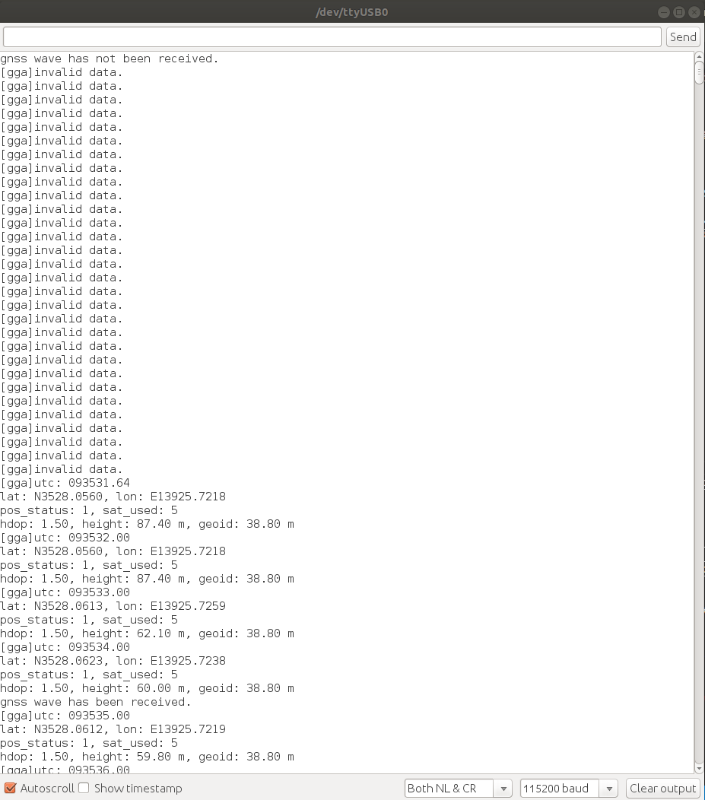
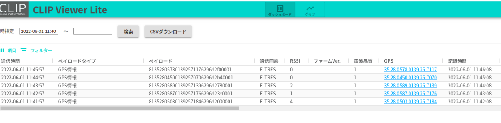
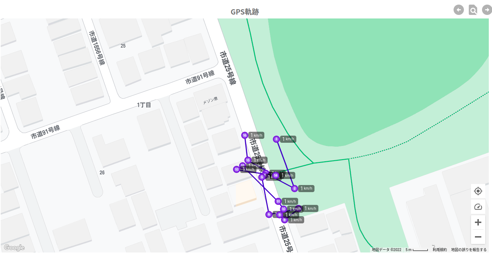

# SPRESENSE用ELTRESアドオンボード

SPRESENSE用ELTRESアドオンボードを使って、様々なセンサーから取得したデータをELTRES通信によりCLIP Viewer Lite サーバーに送信するサンプルとなります。
本サンプルはGPS情報を1分ごとにCLIP Viewer Lite サーバーに送信するとなっています。

## 動作確認したときの環境
### 開発環境
- PC: Ubuntu 18.04
- Arduino IDE:v1.8.13
- Spresense Arduino:v2.6.0

### 使用デバイス
- Spresense Main Board
- ELTRES Add-onボード

## 事前準備
- ELTRESアドオンボード用のライブラリをインストールします。取扱説明書およびライブラリのダウンロードは[こちら](https://www.cresco-dt.co.jp/service/iot/iot-poc/eltres/)への登録が必要になります。なお、ELTRESアドオンボード用のライブラリをインストール済みの場合は実施不要です。

- [Spresense Arduino スタートガイド](https:/er.sony.com/spresense/docs/arduino_set_up_ja.html)に記載の手順に従って環境を構築する
  ※Spresense Arduino環境インストール済みの場合は実施不要

## ビルド方法
1. [Arduinoソースコードビルド方法](https:/er.sony.com/spresense/docs/arduino_set_up_ja.html#_led_%E3%81%AE%E3%82%B9%E3%82%B1%E3%83%83%E3%83%81%E3%82%92%E5%8B%95%E3%81%8B%E3%81%97%E3%81%A6%E3%81%BF%E3%82%8B)を参照して、
[SPRESENSE用ELTRESアドオンボードソースコード](./eltres_sample/eltres_sample.ino)をArduino IDEで開いてマイコンボードに書き込む ボタンをクリックして、スケッチのコンパイルと書き込みを行います。
2. スケッチの書き込みが完了するまで待ちます。
3. スケッチの書き込みが完了すると自動的にリセットがかかってプログラムが起動されます。

## サンプルプログラム

### 使用方法
1. Arduino IDEのシリアルモニタを開くだけです。

|シリアルモニタを開く|GSPテキスト情報|GPSマップ|
|----|----|----|
||||

### 操作方法
[こちら](https://www.cresco-dt.co.jp/service/iot/iot-poc/eltres/)へ登録して、CLIPViewerLite操作マニュアルを参照してください。

### 確認方法
[こちら](https://www.cresco-dt.co.jp/service/iot/iot-poc/eltres/)へ登録して、CLIPViewerLite操作マニュアルを参照してください。
- 2022/12/21に特に問題がないことを動作確認済み。

## 参考ページ
- [Spresense Arduino スタートガイド](https:/er.sony.com/spresense/docs/arduino_set_up_ja.html)

## 変更履歴
|バージョン|リリース日|変更概要|
|----|----|----|
|v0.1|2022.06.01|内部リリース|
|v0.2|2022.12.23|Spresense Arduino:v2.6.0で動作確認及びドキュメント更新|
