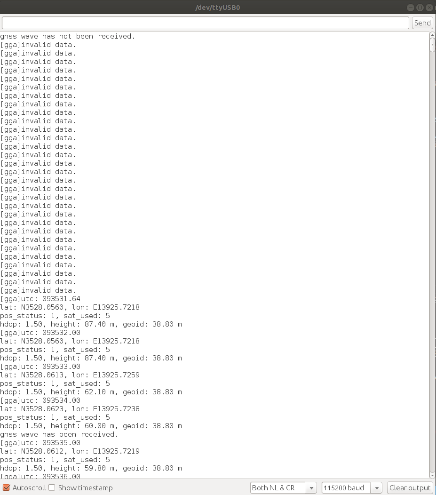
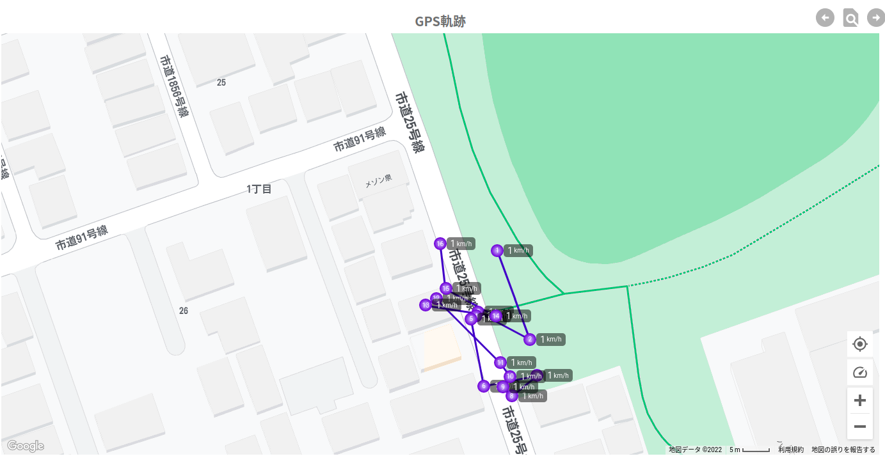
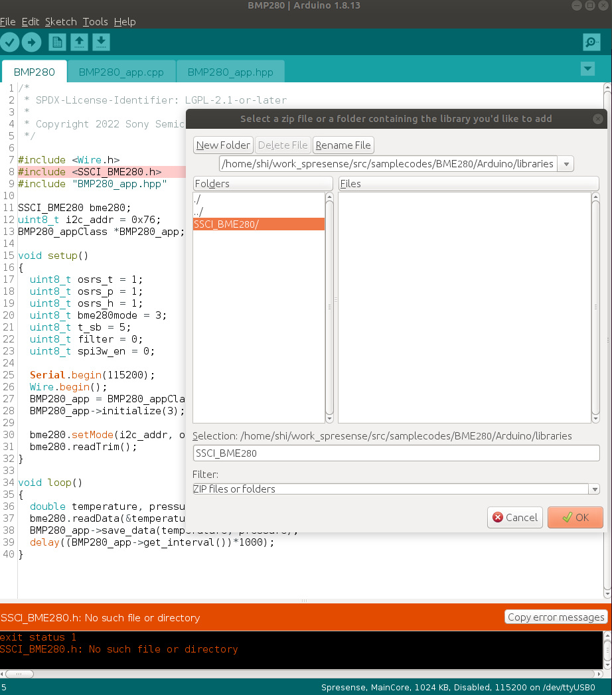

# SPRESENSE用ELTRESアドオンボード

# 説明
SPRESENSE用ELTRESアドオンボードを使って、様々なセンサーから取得したデータをELTRES通信によりCLIP Viewer Lite サーバーに送信するサンプルとなります。
本サンプルはGPS,温度、気圧情報を３分ごとにCLIP Viewer Lite サーバーに送信するとなっています。

# 動作例
|シリアルモニタを開く|GSP、温度、気圧情報|GPSマップ|
|----|----|----|
||||

# Release note
|バージョン|リリース日|変更概要|
|----|----|----|
|v0.1|2022.05.13|内部リリース|
|v0.2|2022.12.23|Spresense Arduino:v2.6.0で動作確認及びドキュメント更新|

# 環境
- PC
  - Ubuntu 18.04
  - Arduino IDE:v1.8.13
- Spresense Arduino:v2.6.0
- Spresense Main Board
- Spresense 用 BMP280 Add-on ボード
- ELTRES Add-onボード

# セットアップ
- ELTRESアドオンボード用のライブラリをインストールします。取扱説明書およびライブラリのダウンロードは[こちら](https://www.cresco-dt.co.jp/service/iot/iot-poc/eltres/)への登録が必要になります。なお、ELTRESアドオンボード用のライブラリをインストール済みの場合は実施不要です。

- [Spresense Arduino スタートガイド](https:/er.sony.com/spresense/docs/arduino_set_up_ja.html)に記載の手順に従って環境を構築する
  ※Spresense Arduino環境インストール済みの場合は実施不要
- [BME280 library](https://github.com/SWITCHSCIENCE/samplecodes/tree/master/BME280/Arduino/libraries/SSCI_BME280)をインストールします。なお、[BME280 library](https://github.com/SWITCHSCIENCE/samplecodes/tree/master/BME280/Arduino/libraries/SSCI_BME280)をインストール済みの場合は実施不要です。
  - ライブラリをインストールする方法：まずはライブラリをローカルにダウンロードします。Arduino IDEのメニューから[Sketch]→[Include Library]→[Add .ZIP Library...]から、ライブラリを保存する場所を選択してOKボトンを押すだけです。

|①ライブラリをダウンロードする|②メニューからライブラリをインストールする|③フォルドもしくはZIPファイル場所を選択する|
|----|----|----|
|git clone https://github.com/SWITCHSCIENCE/samplecodes.git|||
# ビルド方法
1. [Arduinoソースコードビルド方法](https:/er.sony.com/spresense/docs/arduino_set_up_ja.html#_led_%E3%81%AE%E3%82%B9%E3%82%B1%E3%83%83%E3%83%81%E3%82%92%E5%8B%95%E3%81%8B%E3%81%97%E3%81%A6%E3%81%BF%E3%82%8B)を参照して、
[eltres_sample.ino](./eltres_sample.ino)をArduino IDEで開いてマイコンボードに書き込む ボタンをクリックして、スケッチのコンパイルと書き込みを行います。
2. スケッチの書き込みが完了するまで待ちます。
3. スケッチの書き込みが完了すると自動的にリセットがかかってプログラムが起動されます。

# 使用方法
1. Arduino IDEのシリアルモニタを開くだけです。

# 操作方法
[こちら](https://www.cresco-dt.co.jp/service/iot/iot-poc/eltres/)への登録して、CLIPViewerLite操作マニュアルを参照してください。

# 確認方法
[こちら](https://www.cresco-dt.co.jp/service/iot/iot-poc/eltres/)への登録して、CLIPViewerLite操作マニュアルを参照してください。
- 2022/12/21に特に問題がないことを動作確認済み。

# 参考ページ
- [Spresense Arduino スタートガイド](https:/er.sony.com/spresense/docs/arduino_set_up_ja.html)

