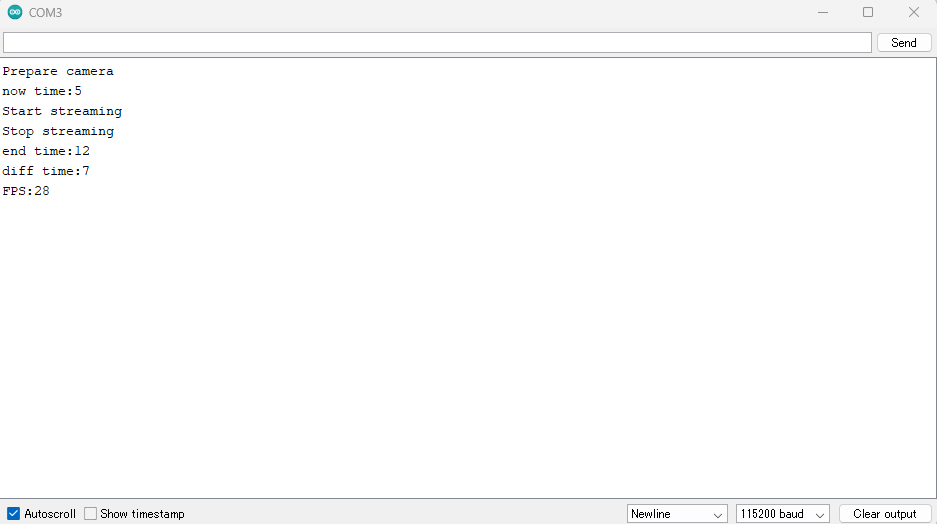

# FPSを測定するサンプルプログラム
[HDRカメラボード](https://developer.sony.com/develop/spresense/docs/introduction_ja.html#_spresense_hdr_%E3%82%AB%E3%83%A1%E3%83%A9%E3%83%9C%E3%83%BC%E3%83%89)で写真を200枚撮影し、この過程におけるFPSを算出して表示します。

## 動作確認したときの環境
### 開発環境
- PC: Windows 11
- Arduino IDE:v1.8.13
- Spresense Arduino:v2.6.0

### 使用デバイス
- Spresense Main Board
- HDR Camera

## 事前準備
- [Spresense Arduino スタートガイド](https://developer.sony.com/develop/spresense/docs/arduino_set_up_ja.html)に記載の手順に従って環境を構築する
  ※Spresense Arduino環境インストール済みの場合は実施不要

## ビルド方法
1. [Arduinoソースコードビルド方法](https://developer.sony.com/develop/spresense/docs/arduino_set_up_ja.html#_led_%E3%81%AE%E3%82%B9%E3%82%B1%E3%83%83%E3%83%81%E3%82%92%E5%8B%95%E3%81%8B%E3%81%97%E3%81%A6%E3%81%BF%E3%82%8B)を参照して、
[cal_fps.ino](cal_fps.ino)をArduino IDEで開いてマイコンボードに書き込む ボタンをクリックして、スケッチのコンパイルと書き込みを行います。
2. スケッチの書き込みが完了するまで待ちます。
3. スケッチの書き込みが完了すると自動的にリセットしてプログラムが起動します。

## サンプルプログラム

### 使用方法
Arduino IDEのシリアルモニタを開きます。

|シリアルモニタを開く|
|----|
||

### 操作方法
特に不要。

### 確認方法
シリアルモニタにてログを確認します。
- 2022/12/22に特に問題がないことを動作確認済み。

## 参考ページ
- [Spresense Arduino スタートガイド](https://developer.sony.com/develop/spresense/docs/arduino_set_up_ja.html)

## 変更履歴
|バージョン|リリース日|変更概要|
|----|----|----|
|0.1|2022/12/23|内部リリース|
