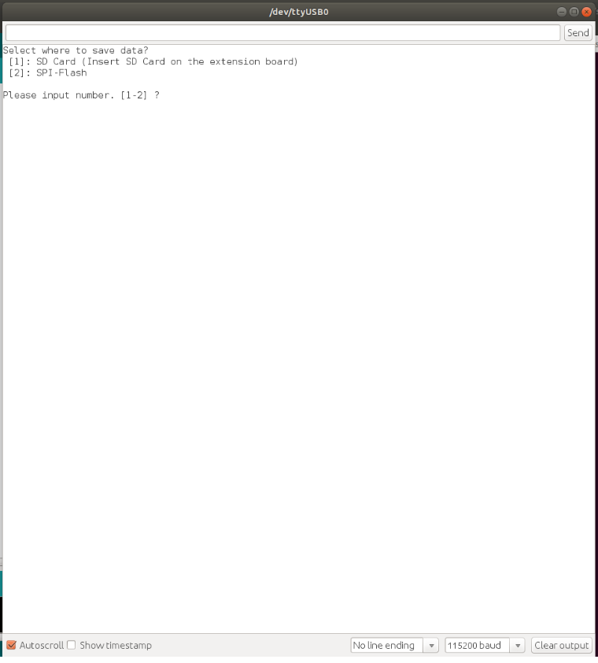
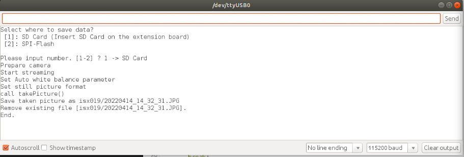
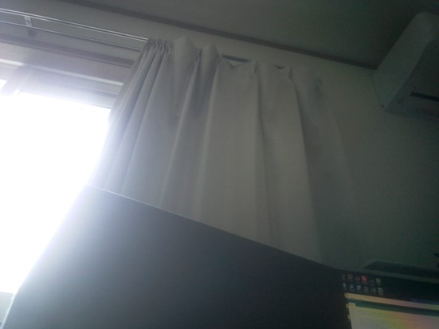
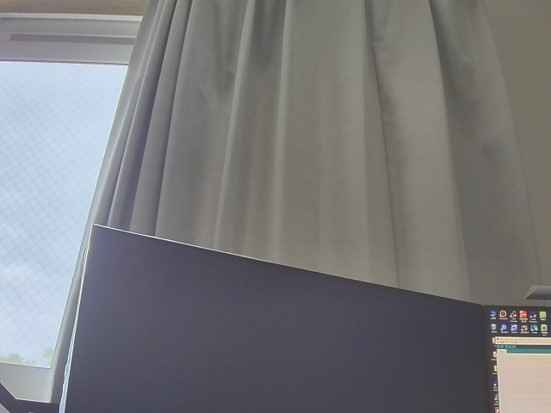

# HDRカメラボード(ISX019)サンプルプログラム
[HDRカメラボード](https://developer.sony.com/develop/spresense/docs/introduction_ja.html#_spresense_hdr_%E3%82%AB%E3%83%A1%E3%83%A9%E3%83%9C%E3%83%BC%E3%83%89)からデータを取得して、FlashメモリとSDカードのどちらにJPEGの形式で保存するサンプルプログラムです。データ取得間隔は秒単位で設定できます。

## 動作確認したときの環境

### 開発環境
- PC: Windows 11 
- Arduino IDE: v1.8.13/v2.1.0
- Spresense Arduino: v2.6.0/v3.0.0

### 使用デバイス
- Spresense Main Board
- HDR Camera

## 事前準備
- [Spresense Arduino スタートガイド](https://developer.sony.com/develop/spresense/docs/arduino_set_up_ja.html)に記載の手順に従って環境を構築する
  ※Spresense Arduino環境インストール済みの場合は実施不要

## ビルド方法
1. [Arduinoソースコードビルド方法](https://developer.sony.com/develop/spresense/docs/arduino_set_up_ja.html#_led_%E3%81%AE%E3%82%B9%E3%82%B1%E3%83%83%E3%83%81%E3%82%92%E5%8B%95%E3%81%8B%E3%81%97%E3%81%A6%E3%81%BF%E3%82%8B)を参照して、
[isx019.ino](isx019.ino)をArduino IDEで開いてマイコンボードに書き込む ボタンをクリックして、スケッチのコンパイルと書き込みを行います。
2. スケッチの書き込みが完了するまで待ちます。
3. スケッチの書き込みが完了すると自動的にリセットしてプログラムが起動します。

## サンプルプログラム
### 使用方法
Arduino IDEのシリアルモニタを開いて、データの保存先を選択してEnterキーを押すだけです。
|シリアルモニタを開く|保存場所を選択する|[カメラボード(ISX012)](https://developer.sony.com/develop/spresense/docs/introduction_ja.html#_spresense_%E3%82%AB%E3%83%A1%E3%83%A9%E3%83%9C%E3%83%BC%E3%83%89)画像|[HDRカメラボード(ISX019)](https://developer.sony.com/develop/spresense/docs/introduction_ja.html#_spresense_hdr_%E3%82%AB%E3%83%A1%E3%83%A9%E3%83%9C%E3%83%BC%E3%83%89)画像|
|----|----|----|----|
|||||

### 操作方法
Arduino IDEのシリアルモニタを開いている状態で、以下のキーを入力することで操作が可能
|入力キー|動作|
|----|----|
|1＋Enterキー|データをSDカードに保存する|
|2＋Enterキー|データをFlashメモリに保存する|

### FlashメモリとSDカード共通
[Zmodem を使ってPCにファイル転送](https://developer.sony.com/develop/spresense/docs/sdk_tutorials_ja.html#_tips_zmodem)に記載の手順に従ってファイルをPCで確認できます。
- 2022/12/22に特に問題がないことを動作確認済み。

### SDカードのみ
SDカードに対応したPCであれば手動でSDカードをPCに差し込んで確認できます。

## 参考ページ
- [Spresense Arduino スタートガイド](https://developer.sony.com/develop/spresense/docs/arduino_set_up_ja.html)
- [Zmodem を使ってPCにファイル転送](https://developer.sony.com/develop/spresense/docs/sdk_tutorials_ja.html#_tips_zmodem)

## 変更履歴
|バージョン|リリース日|変更概要|
|----|----|----|
|0.1|2022/05/16|内部リリース|
|0.2|2022/12/23|コメントアウト・ドキュメント修正|

