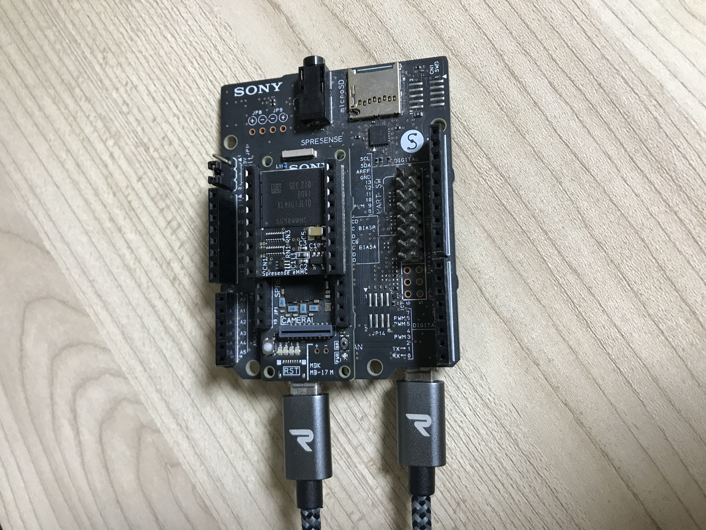
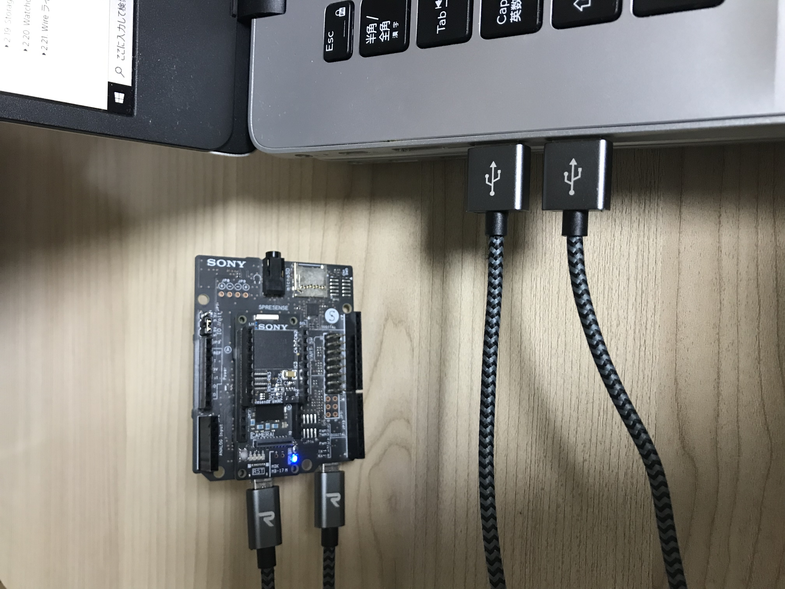
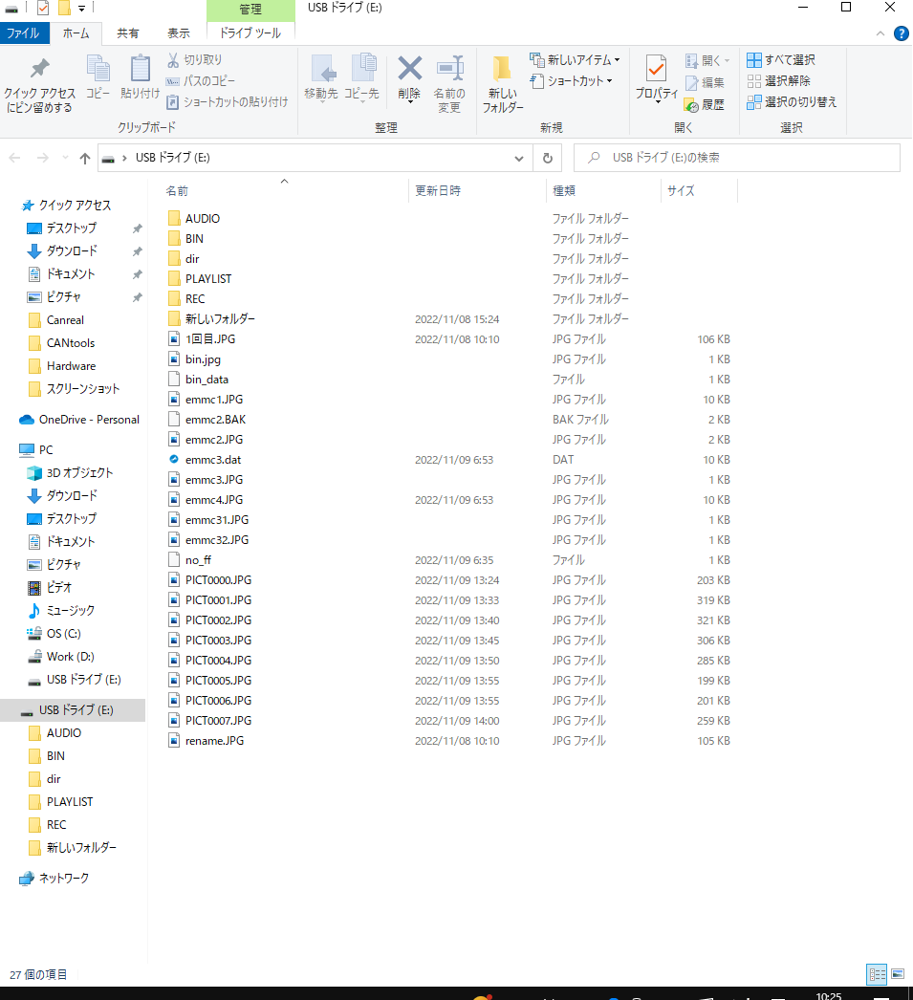

# UsbMscサンプルプログラム

本サンプルはUSB MSC 機能のサンプルです。[Spresense 用 eMMC(KLMAG1JETD-B041) AddOnボード](https://nextstep.official.ec/items/66602892)を使用して、eMMC デバイスが PC 上のドライブとしてマウントされ、PC から eMMC デバイスに直接アクセスすることができます。

## 動作確認したときの環境
### 開発環境
- PC: Ubuntu 18.04
- Arduino IDE:v1.8.13
- Spresense Arduino:v2.6.0

### 使用デバイス
- Spresense メインボード
- Spresense 拡張ボード
- Spresense 用 eMMC(KLMAG1JETD-B041) AddOnボード
- micro USB Type-B の USB ケーブル 2本

## 事前準備
- [Spresense Arduino スタートガイド](https://developer.sony.com/develop/spresense/docs/arduino_set_up_ja.html)に記載の手順に従って環境を構築します。なお、Spresense Arduino環境インストール済みの場合は実施不要です。

## ビルド方法
1. [Arduinoソースコードビルド方法](https://developer.sony.com/develop/spresense/docs/arduino_set_up_ja.html#_led_%E3%81%AE%E3%82%B9%E3%82%B1%E3%83%83%E3%83%81%E3%82%92%E5%8B%95%E3%81%8B%E3%81%97%E3%81%A6%E3%81%BF%E3%82%8B)を参照して、
[UsbMsc.ino](./UsbMsc.ino)をArduino IDEで開いてマイコンボードに書き込む ボタンをクリックして、スケッチのコンパイルと書き込みを行います。
2. スケッチの書き込みが完了するまで待ちます。
3. スケッチの書き込みが完了すると自動的にリセットしてプログラムが起動します。

## サンプルプログラム

### 使用方法
2本のmicro USB Type-B の USB ケーブルを使用する必要があります。
|それぞれをSpresense メインボーと Spresense 拡張ボードと接続する|それぞれをPC と 接続する|
|----|----|
|||

### 操作方法
自動的にドライブとして認識されるまでまつだけ。

### 確認方法
|PCから自動認識されたドライブをアクセスする|
|----|
||

## 参考ページ
- [Spresense Arduino スタートガイド](https://developer.sony.com/develop/spresense/docs/arduino_set_up_ja.html)
- [Spresense 用 eMMC(KLMAG1JETD-B041) AddOnボード](https://nextstep.official.ec/items/66602892)

## 変更履歴
|リリース日|変更点|
|----|----|
|2022/11/11|初版|
|2022/12/16|Spresense Arduino:v2.6.0にて動作確認済み|
