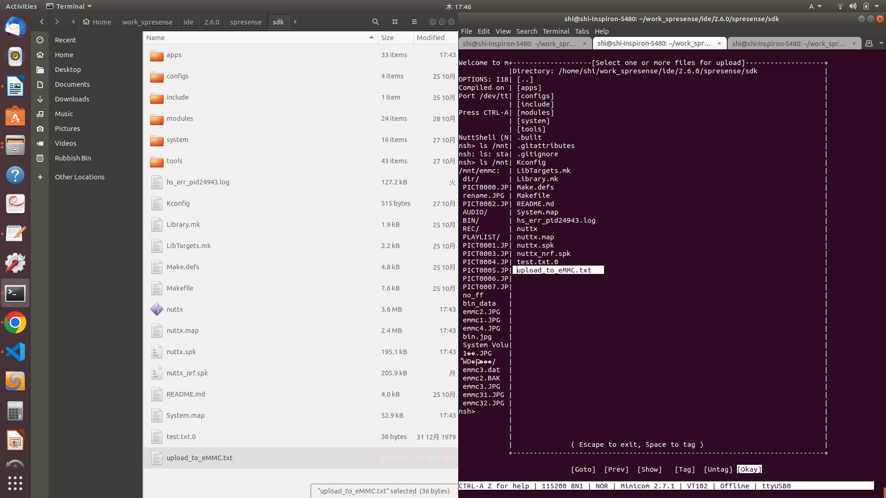

<div align="right">
<a href="https://developer.sony.com/ja/develop/ssup/"></a>
</div>

# eMMCからHostPCへZmodemでファイル送受信の動作確認

Zmodem 転送を利用して HostPC と Spresense ボードとの間でファイルを送受信する方法について示します。

## 動作確認したときの環境
### 開発環境
- PC: Ubuntu 18.04
- Spresense SDK:v2.6.0

### 使用デバイス
- Spresense メインボード
- Spresense 用 eMMC(KLMAG1JETD-B041) AddOnボード

## 事前準備
- [Spresense SDK スタートガイド (CLI 版)](https://developer.sony.com/develop/spresense/docs/sdk_set_up_ja.html)に記載の手順に従って環境を構築します。なお、Spresense SDK スタートガイド (CLI 版)環境インストール済みの場合は実施不要です。
- Zmodem 転送機能に対応したシリアルターミナルを使用してください。
ここでは、minicom を例にとって説明します。
minicom や lrzsz がインストールされていない場合は事前にインストールしてください。
  ```console
   sudo apt install minicom lrzsz
   ```
   minicom を起動します。
   ```console
   minicom -D /dev/ttyUSB0 -b 115200
   ```
## ビルド方法
1. sdk ディレクトリへ移動します。
   build-env.sh スクリプトを読み込むことで、config.py ツールの Tab 補完機能が有効になります。
   ```console
   cd spresense/sdk
   source tools/build-env.sh
   ```
2. SDK のコンフィグレーションとビルドを行います。
   引数に feature/zmodem device/emmc -m を指定してコンフィグレーションを実行します。
   ```console
   tools/config.py feature/zmodem device/emmc -m
   ```
   下記のようにZmodemでSpresense上へ転送パスをemmcに修正します。
   
   
   ビルドに成功すると sdk フォルダ直下に nuttx.spk ファイルが生成されます。
   ```console
   make
   ```
   
3. nuttx.spk を Spresense ボードへ書き込みます。
   この例では シリアルポートとして /dev/ttyUSB0 を、書き込み速度の baudrate に 500000 bps を設定しています。お使いの環境に合わせて変更してください。
   ```console
   tools/flash.sh -c /dev/ttyUSB0 -b 500000 nuttx.spk
   make
   ```

## HostPC から eMMC へのファイル転送方法
1. minicom 上で CTRL-a を押下した後に z キーを押してメニューを開きます。(このショートカットキーの割り当てはユーザー側で変更可能です。詳細は minicom のマニュアルを参照してください。)
続けて s キーを押して Send files (ファイル送信) を選択します。
  
2. カーソルキーで zmodem を選択して Enter キーで実行します。
  
3. カーソルキーとスペースキーでフォルダを移動をして転送したいファイルを選択します。
カーソルキーでフォルダを選びスペースキーを2回押すとフォルダへ移動できます。
カーソルキーでファイルを選びスペースキーで選択した後に Enter キーを押すと転送を開始します。
  
  もしくは、Enter キーを押してファイル名を入力して転送を実行することもできます。
  
4. ファイル転送が始まり、Transfer complete と表示されれば転送完了です。
  

## eMMC から HostPC へのファイル転送方法
1. NuttShell 上で、sz コマンドの引数に転送したいファイルを指定して実行します。
ファイル名は / から始まるフルパス名を入力してください。
以下の例は、-x 1 バイナリ転送オプションを付けています。
   ```console
   nsh> sz -x 1 /mnt/emmc/test00.dat
   ```
2. ファイル転送が始まり、Transfer complete と表示されれば転送完了です。
  
3. HostPC 上の minicom を実行したフォルダにファイルが転送されます


## 確認方法

|eMMCからHostPCへZmodemでフィアル転送|HostPCからへeMMCZmodemでフィアル転送|
|----|----|
|||

## 参考ページ
- [Spresense SDK スタートガイド (CLI 版)](https://developer.sony.com/develop/spresense/docs/sdk_set_up_ja.html)
- [Zmodem を使ったファイル転送](https://developer.sony.com/develop/spresense/docs/sdk_tutorials_ja.html#_tips_zmodem)
- [Spresense 用 eMMC(KLMAG1JETD-B041) AddOnボード](https://nextstep.official.ec/items/66602892)


## 変更履歴
|リリース日|変更点|
|----|----|
|2022/11/11|初版|
