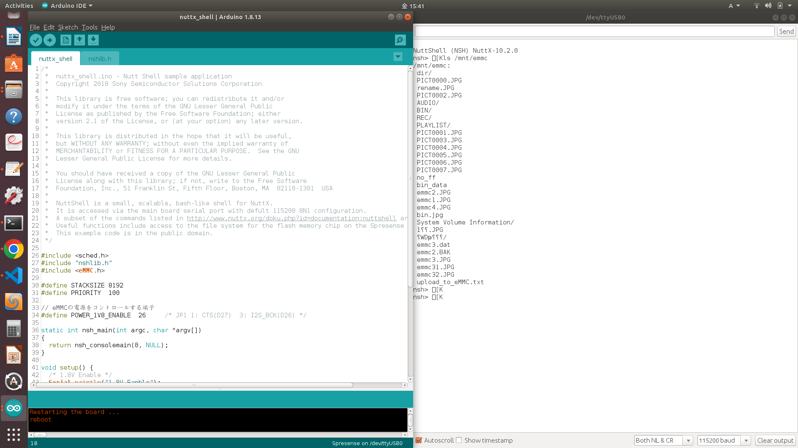

# nuttx_shellサンプルプログラム

本サンプルは[Spresense 用 eMMC(KLMAG1JETD-B041) AddOnボード](https://nextstep.official.ec/items/66602892)を使用して、シリアルターミナルに NuttShell nsh> プロンプトを表示するサンプルです。

## 動作確認したときの環境
### 開発環境
- PC: Ubuntu 18.04 または Windows 11
- Arduino IDE:v1.8.13/v2.1.0
- Spresense Arduino:v2.6.0/v3.0.0

### 使用デバイス
- Spresense メインボード
- Spresense 用 eMMC(KLMAG1JETD-B041) AddOnボード

## 事前準備
- [Spresense Arduino スタートガイド](https://developer.sony.com/develop/spresense/docs/arduino_set_up_ja.html)に記載の手順に従って環境を構築します。なお、Spresense Arduino環境インストール済みの場合は実施不要です。

## ビルド方法
1. [Arduinoソースコードビルド方法](https://developer.sony.com/develop/spresense/docs/arduino_set_up_ja.html#_led_%E3%81%AE%E3%82%B9%E3%82%B1%E3%83%83%E3%83%81%E3%82%92%E5%8B%95%E3%81%8B%E3%81%97%E3%81%A6%E3%81%BF%E3%82%8B)を参照して、
[nuttx_shell.ino](./nuttx_shell.ino)をArduino IDEで開いてマイコンボードに書き込む ボタンをクリックして、スケッチのコンパイルと書き込みを行います。
2. スケッチの書き込みが完了するまで待ちます。
3. スケッチの書き込みが完了すると自動的にリセットしてプログラムが起動します。

## サンプルプログラム

### 操作方法
シリアルモニタを開いて"ls /mnt/emmc"を入力して、Enterキーを押すだけです。

### 確認方法
|"/mnt/emmc" ディレクトリ存在するかを確認|
|----|
||

## 参考ページ
- [Spresense Arduino スタートガイド](https://developer.sony.com/develop/spresense/docs/arduino_set_up_ja.html)
- [Spresense 用 eMMC(KLMAG1JETD-B041) AddOnボード](https://nextstep.official.ec/items/66602892)
- [GPS ロガーデータの確認手順のnuttx_shellスケッチ](https://developer.sony.com/develop/spresense/docs/arduino_tutorials_ja.html#_gps_%E3%83%AD%E3%82%AC%E3%83%BC%E3%83%87%E3%83%BC%E3%82%BF%E3%81%AE%E7%A2%BA%E8%AA%8D%E6%89%8B%E9%A0%86)

## 変更履歴
|リリース日|変更点|
|----|----|
|2022/11/11|初版|
|2022/12/16|Spresense Arduino:v2.6.0にて動作確認済み|
