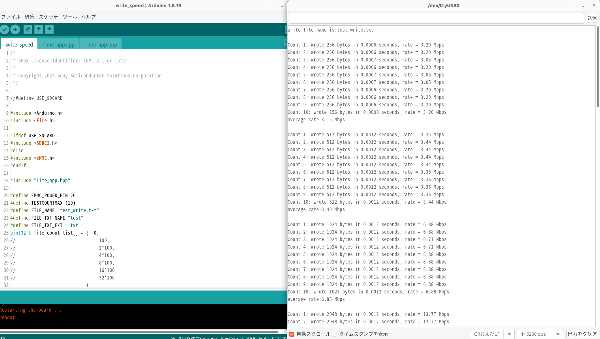
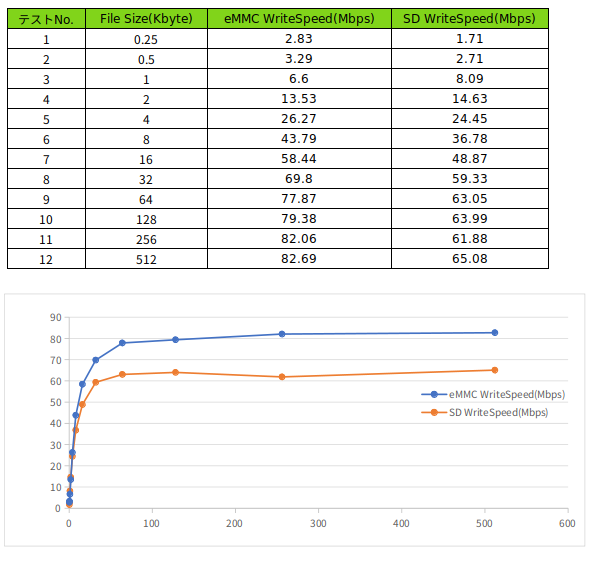

# write_speedサンプルプログラム

本サンプルは[Spresense 用 eMMC(KLMAG1JETD-B041) AddOnボード](https://nextstep.official.ec/items/66602892)を使用して、eMMCの書き込み速度を測定するためのサンプルです。
- ソースコード#define USE_SDCARDを定義すると、eMMCの代わりにSDカードの書き込み速度を測定できます。
- SDカードの種類や使用状況によって結果が異なります。 手持ちのSDカードでパフォーマンスを測定してみてください。

## 動作確認したときの環境
### 開発環境
- PC: Ubuntu 22.04
- Arduino IDE:v1.8.19
- Spresense Arduino:v3.0.0

### 使用デバイス
- Spresense メインボード
- Spresense 拡張ボード
- Spresense 用 eMMC(KLMAG1JETD-B041) AddOnボード
- SDカード

## セットアップ
- [Spresense Arduino スタートガイド](https://developer.sony.com/develop/spresense/docs/arduino_set_up_ja.html)に記載の手順に従って環境を構築します。なお、Spresense Arduino環境インストール済みの場合は実施不要です。

## ビルド方法
1. [Arduinoソースコードビルド方法](https://developer.sony.com/develop/spresense/docs/arduino_set_up_ja.html#_led_%E3%81%AE%E3%82%B9%E3%82%B1%E3%83%83%E3%83%81%E3%82%92%E5%8B%95%E3%81%8B%E3%81%97%E3%81%A6%E3%81%BF%E3%82%8B)を参照して、
[write_speed.ino](./write_speed.ino)をArduino IDEで開いてマイコンボードに書き込む ボタンをクリックして、スケッチのコンパイルと書き込みを行います。
2. スケッチの書き込みが完了するまで待ちます。
3. スケッチの書き込みが完了すると自動的にリセットしてプログラムが起動します。

## サンプルプログラム

### 動作例

|eMMCの書き込み速度の測定|
|----|
||

|eMMCとSDカードの書き込み速度測定の比較|
|----|
||

### 操作方法
Arduino IDEのシリアルモニタを開くだけです。

### 確認方法
- Arduino IDEのシリアルモニタでログをご参照ください。

## 参考ページ
- [Spresense Arduino スタートガイド](https://developer.sony.com/develop/spresense/docs/arduino_set_up_ja.html)
- [Spresense 用 eMMC(KLMAG1JETD-B041) AddOnボード](https://nextstep.official.ec/items/66602892)
- [Camera チュートリアル](https://developer.sony.com/develop/spresense/docs/arduino_tutorials_ja.html#_tutorial_camera)

## 変更履歴
|リリース日|変更点|
|----|----|
|2023/08/04|初版|