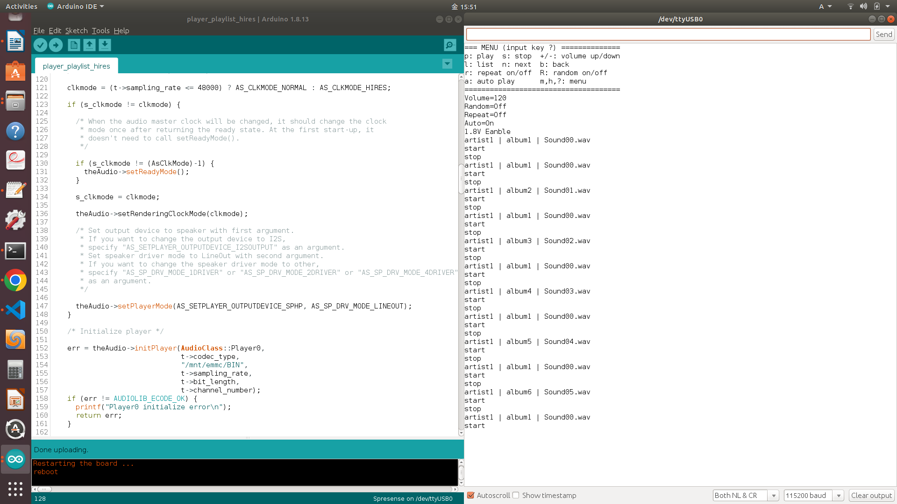

# player_playlist_hiresサンプルプログラム

本サンプルは[Spresense 用 eMMC(KLMAG1JETD-B041) AddOnボード](https://nextstep.official.ec/items/66602892)を使用して、プレイリスト (playlist) を使用して高いサンプリングの音楽を再生するためのサンプルです。

## 動作確認したときの環境
### 開発環境
- PC: Ubuntu 18.04
- Arduino IDE:v1.8.13
- Spresense Arduino:v2.6.0

### 使用デバイス
- Spresense メインボード
- Spresense 拡張ボード
- Spresense 用 eMMC(KLMAG1JETD-B041) AddOnボード
- 再生用ヘッドホン or スピーカー

## 事前準備
- [Spresense Arduino スタートガイド](https://developer.sony.com/develop/spresense/docs/arduino_set_up_ja.html)に記載の手順に従って環境を構築します。なお、Spresense Arduino環境インストール済みの場合は実施不要です。

## ビルド方法
1. [Arduinoソースコードビルド方法](https://developer.sony.com/develop/spresense/docs/arduino_set_up_ja.html#_led_%E3%81%AE%E3%82%B9%E3%82%B1%E3%83%83%E3%83%81%E3%82%92%E5%8B%95%E3%81%8B%E3%81%97%E3%81%A6%E3%81%BF%E3%82%8B)を参照して、
[player_playlist_hires.ino](./player_playlist_hires.ino)をArduino IDEで開いてマイコンボードに書き込む ボタンをクリックして、スケッチのコンパイルと書き込みを行います。
2. スケッチの書き込みが完了するまで待ちます。
3. スケッチの書き込みが完了すると自動的にリセットしてプログラムが起動します。

## サンプルプログラム

### 動作例
|高いサンプリングの音声再生(192KHz,MONO,16bit,上記の録音ファイルを再生する)|
|----|
||

### 動作手順
[Spresenseプレイヤー再生動作手順](https://developer.sony.com/develop/spresense/docs/arduino_tutorials_ja.html#_%E5%8B%95%E4%BD%9C%E6%89%8B%E9%A0%86_5)をご参照ください。

### 確認方法
- 再生用ヘッドホン or スピーカーでご確認ください。

## 参考ページ
- [Spresense Arduino スタートガイド](https://developer.sony.com/develop/spresense/docs/arduino_set_up_ja.html)
- [Spresense 用 eMMC(KLMAG1JETD-B041) AddOnボード](https://nextstep.official.ec/items/66602892)
- [ハイレゾオーディオを再生する](https://developer.sony.com/develop/spresense/docs/arduino_tutorials_ja.html#_%E3%83%8F%E3%82%A4%E3%83%AC%E3%82%BE%E3%82%AA%E3%83%BC%E3%83%87%E3%82%A3%E3%82%AA%E3%82%92%E5%86%8D%E7%94%9F%E3%81%99%E3%82%8B)
- [プレイリスト再生](https://developer.sony.com/develop/spresense/docs/arduino_tutorials_ja.html#_%E3%83%97%E3%83%AC%E3%82%A4%E3%83%AA%E3%82%B9%E3%83%88%E5%86%8D%E7%94%9F)

## 変更履歴
|リリース日|変更点|
|----|----|
|2022/11/11|初版|
|2022/12/16|Spresense Arduino:v2.6.0にて動作確認済み|
