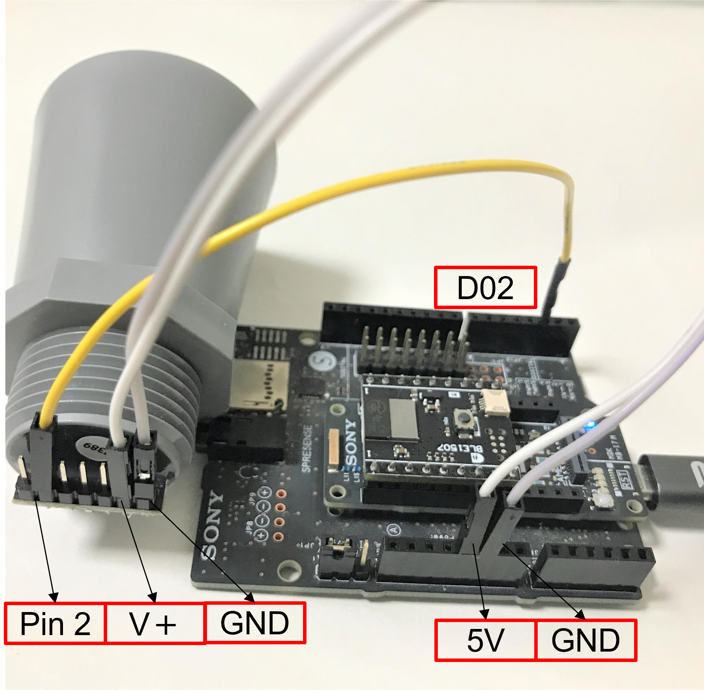
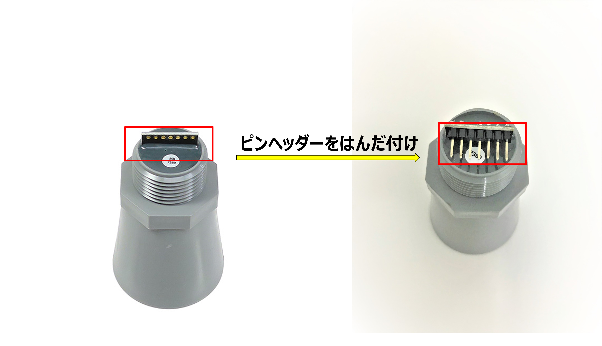

# 超音波センサー(MB7389-100)

[超音波センサー(MB7389-100)](https://www.maxbotix.com/ultrasonic_sensors/mb7389.htm)は、ミリメートルの分解能を持った短長距離データを取得可能な超音波センサーです。センサーの詳細については、[HRXL-Maxsonar-WR Datasheet](https://maxbotix.com/pages/hrxl-maxsonar-wr-datasheet)を確認してください。

## 接続方法

### Pulse width

|MaxBotix MB7389 Sensor | Spresense |
|----|----|
|GND | GND|
|V+ | 5V |
|Pin 2 | D02 |

[MB7389 x Arduino Tutorial](https://maxbotix.com/blogs/blog/mb7389-x-arduino-tutorial-with-code-examples)より

### Analog voltage

|MaxBotix MB7389 Sensor | Spresense |
|----|----|
|GND | GND|
|V+ | 5V |
|Pin 3 | A0 |

[MB7389 x Arduino Tutorial](https://maxbotix.com/blogs/blog/mb7389-x-arduino-tutorial-with-code-examples)より

### はんだ付け
Spresenseに接続するにあたって本体にピンヘッダーをはんだ付けしてください。

## 資料

- [MB7389 HRXL-MaxSonar-WRMT](https://maxbotix.com/products/mb7389)
- [HRXL-Maxsonar-WR Datasheet](https://maxbotix.com/pages/hrxl-maxsonar-wr-datasheet)
- [MB7389 x Arduino Tutorial](https://maxbotix.com/blogs/blog/mb7389-x-arduino-tutorial-with-code-examples)

## サンプルプログラム
- [距離データの取得](mb7389)

