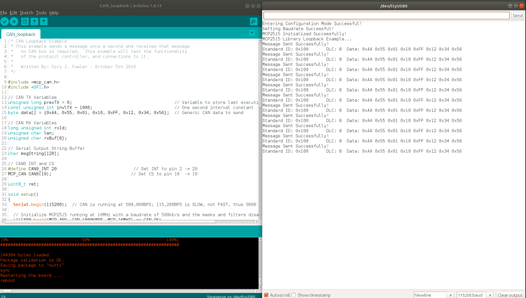

# CAN_loopbackサンプルプログラム

本サンプルは、 [Spresense 用 CAN AddOnボード](https://nextstep.official.ec/items/38434337)を使用して、１ボードでCANの送受信を確認できるサンプルとなります。

## 動作確認したときの環境
### 開発環境
- PC: Ubuntu 18.04
- Arduino IDE:v1.8.13
- Spresense Arduino:v2.6.0

### 使用デバイス
- Spresense Main Board
- Spresense 用 CAN AddOnボード

### ライブラリ
- [CAN library](https://github.com/TomonobuHayakawa/MCP_CAN_lib)

## 事前準備
- [Spresense Arduino スタートガイド](https://developer.sony.com/develop/spresense/docs/arduino_set_up_ja.html)に記載の手順に従って環境を構築します。なお、Spresense Arduino環境インストール済みの場合は実施不要です。

- [CAN library](https://github.com/TomonobuHayakawa/MCP_CAN_lib)をインストールします。Spresense Arduinoライブラリのインストール方法は[こちら](https://github.com/SonySemiconductorSolutions/ssup-spresense-internal/blob/main/FAQ.md#arduino%E3%83%A9%E3%82%A4%E3%83%96%E3%83%A9%E3%83%AA%E3%82%92%E3%82%A4%E3%83%B3%E3%82%B9%E3%83%88%E3%83%BC%E3%83%AB%E3%81%99%E3%82%8B%E6%96%B9%E6%B3%95)をご参照ください。既にインストール済みの場合は実施不要です。

## ビルド方法
1. [Arduinoソースコードビルド方法](https://developer.sony.com/develop/spresense/docs/arduino_set_up_ja.html#_led_%E3%81%AE%E3%82%B9%E3%82%B1%E3%83%83%E3%83%81%E3%82%92%E5%8B%95%E3%81%8B%E3%81%97%E3%81%A6%E3%81%BF%E3%82%8B)を参照して、
[CAN_loopback.ino](https://github.com/TomonobuHayakawa/MCP_CAN_lib/blob/master/examples/CAN_loopback/CAN_loopback.ino)をローカルにダウンロードしてからArduino IDEで開いてマイコンボードに書き込む ボタンをクリックして、スケッチのコンパイルと書き込みを行います。
2. スケッチの書き込みが完了するまで待ちます。
3. スケッチの書き込みが完了すると自動的にリセットしてプログラムが起動します。

## サンプルプログラム
### 使用方法
Arduino IDEのシリアルモニタを開くだけです。
|シリアルモニタを開くだけ|
|----|
||

### 操作方法
特に不要。

### 確認方法
シリアルモニタにてログを確認します。
- ログの中に"Error Sending Message..."のエラーが出た場合、MCP_CAN_lib-master/mcp_can_dfs.hのTIMEOUTVALUEを大きく設定してみてください。
- 2022/12/13に特に問題がないことを動作確認済み。

## 参考ページ
- [Spresense Arduino スタートガイド](https://developer.sony.com/develop/spresense/docs/arduino_set_up_ja.html)
- [Spresense 用 CAN AddOnボード](https://nextstep.official.ec/items/38434337)

## 変更履歴
|リリース日|変更点|
|----|----|
|2022/09/15|初版|
|2022/12/16|3rdパーティーのソースコードをリンクするように修正|
