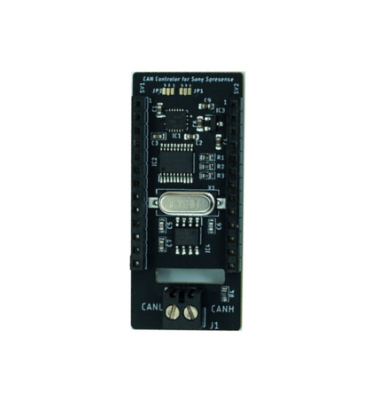
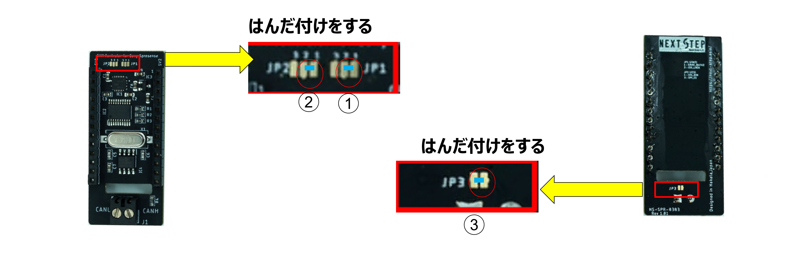

# Spresense 用 CAN AddOnボード

[Spresense 用 CAN AddOnボード](https://nextstep.official.ec/items/38434337)はSony Spresense 用のMicrochip社のMCP2515T-E_STを使ったCANボードです。CANドライバーICは3.3Vで動作するMaxim Integrated社のMAX3051を使用。

Spresenseと同サイズの基板にソケットには13Pのスタッキングピンヘッダを使用していますので別の拡張ボードを積み重ねて使用することができます。
また、カメラの接続用にケーブル用の穴を開けています。

[Spresense 用 CAN AddOnボード](https://nextstep.official.ec/items/38434337)より

## 事前準備
図の3か所をはんだ付けをする必要があります。

[Sony Spresense用 CANボード](https://qiita.com/kaz19610303/items/c43bdd8134b3a47b0e3e)より

## 資料

- [Spresense 用 CAN AddOnボード](https://nextstep.official.ec/items/38434337)

## ライブラリ
- [CAN Lib](https://github.com/TomonobuHayakawa/MCP_CAN_lib)
