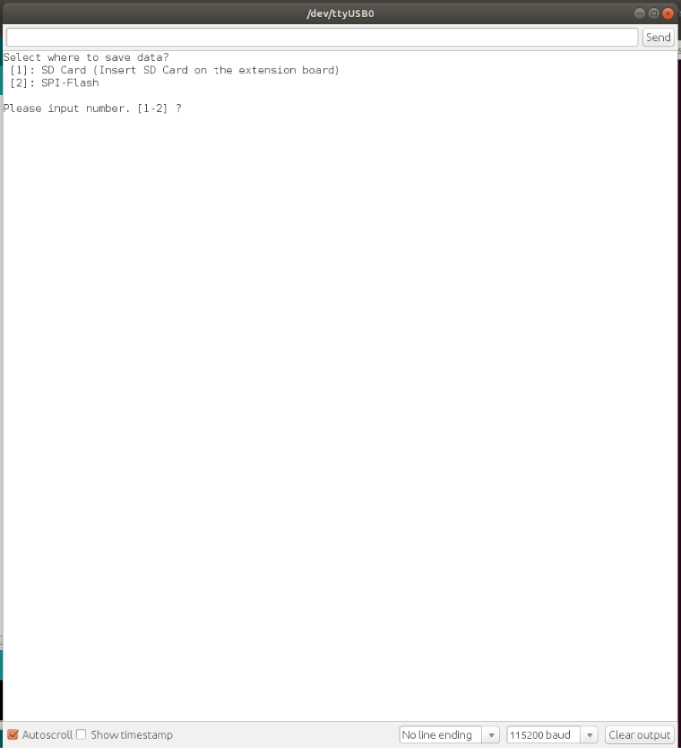
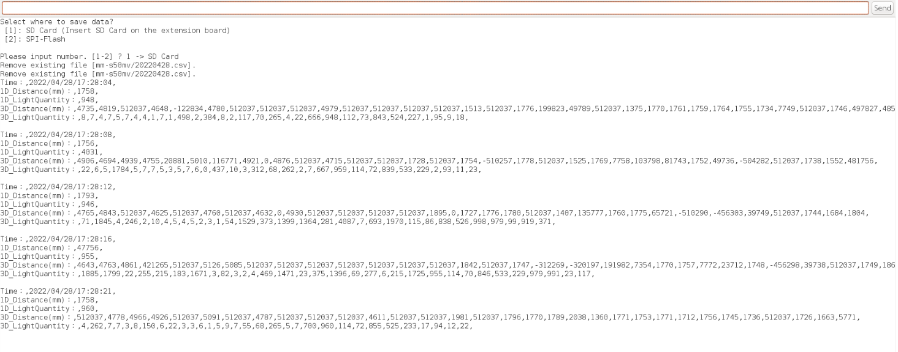
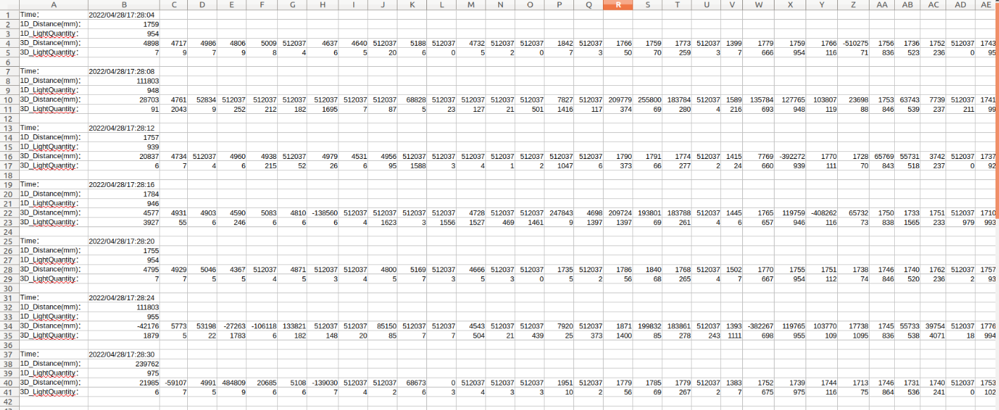

# ToFセンサーサンプルプログラム

[MM-S50MV](https://www.sunhayato.co.jp/material2/ett09/item_1187)のセンサーから1D、3Dの距離と照度のデータを取得して、FlashメモリやSDカードにcsvの形式で保存するサンプルプログラムです。データ取得間隔は秒単位で設定できます。

## 動作確認したときの環境

### 開発環境
- PC: Ubuntu 18.04/22.04
- Arduino IDE v1.8.13
- Spresense Arduino:v2.6.0/v3.0.0

### 使用デバイス
- Spresense Main Board
- Spresense 拡張ボード
- ToFセンサーボード（SPRESENSE用）（MM-S50MV）

### ライブラリ
- [ToF library](https://github.com/TomonobuHayakawa/Spresense-Playground/tree/master/libraries/MM-S50MV)

## 事前準備
- [Spresense Arduino スタートガイド](https://developer.sony.com/develop/spresense/docs/arduino_set_up_ja.html)に記載の手順に従って環境を構築してください。なお、Spresense Arduino環境インストール済みの場合は実施不要です。
- [ToF library](https://github.com/TomonobuHayakawa/Spresense-Playground/tree/master/libraries/MM-S50MV)をインストールします。Spresense Arduinoライブラリのインストール方法は[こちら](https://github.com/SonySemiconductorSolutions/ssup-spresense-internal/blob/main/FAQ.md#arduino%E3%83%A9%E3%82%A4%E3%83%96%E3%83%A9%E3%83%AA%E3%82%92%E3%82%A4%E3%83%B3%E3%82%B9%E3%83%88%E3%83%BC%E3%83%AB%E3%81%99%E3%82%8B%E6%96%B9%E6%B3%95)をご参照ください。既にインストール済みの場合は実施不要です。

## ビルド方法
1. [Arduinoソースコードビルド方法](https://developer.sony.com/develop/spresense/docs/arduino_set_up_ja.html#_led_%E3%81%AE%E3%82%B9%E3%82%B1%E3%83%83%E3%83%81%E3%82%92%E5%8B%95%E3%81%8B%E3%81%97%E3%81%A6%E3%81%BF%E3%82%8B)を参照して、[measure.ino](./measure.ino)をArduino IDEで開いてマイコンボードに書き込むボタンをクリックして、スケッチのコンパイルと書き込みを行います。
2. スケッチの書き込みが完了するまで待ちます。
3. スケッチの書き込みが完了すると自動的にリセットしてプログラムが起動します。

## サンプルプログラム
### 動作例

|取得項目|値の例|
|----|----|
|Time：	|2022/04/28/17:28:04|
|1D_Distance(mm)：|	1759|
|1D_LightQuantity：|	954|
|3D_Distance(mm)：|4898,4717,4986,4806,5009,512037,4637,4640,512037,5188,512037,4732,512037,512037,1842,512037,  1766,1759,1773,512037,1399,1779,1759,1766,-510275,1756,1736,1752,512037,1743,1787,1626|
|3D_LightQuantity：|7,9,7,9,8,4,6,5,20,6,0,5,2,0,7,3,50,70,259,3,7,666,954,116,71,836,523,236,0,95,8,20|

### 使用方法
Arduino IDEのシリアルモニタを開いて、データをどちらに保存するかを選択してEnterキーを押してください。

|シリアルモニタを開く|保存場所を選択する|csvファイルを確認する|
|----|----|----|
||||

(注1)データをずっとファイルに書き込み続けます。終了するには[Spresenseの[RST] Reset button](https://developer.sony.com/develop/spresense/docs/introduction_ja.html)を押してください。 
(注2)データを取得再開する場合、前のファイルを上書きするため、ファイルをバックアップしてからデータを取得してください。

### 操作方法
Arduino IDEのシリアルモニタを開いている状態で、以下のキーを入力することで操作が可能です。
|入力キー|動作|
|----|----|
|1＋Enterキー|データをSDカードに保存する|
|2＋Enterキー|データをFlashメモリに保存する|

### FlashメモリとSDカード共通
[Zmodem を使ってPCにファイル転送](https://developer.sony.com/develop/spresense/docs/sdk_tutorials_ja.html#_tips_zmodem)に記載の手順に従ってファイルをPCで確認できます。

### SDカードのみ
手動でSDカードをPCに差し込み確認できます。

## 参考ページ
- [Spresense Arduino スタートガイド](https://developer.sony.com/develop/spresense/docs/arduino_set_up_ja.html)
- [Zmodem を使ってPCにファイル転送](https://developer.sony.com/develop/spresense/docs/sdk_tutorials_ja.html#_tips_zmodem)

## 変更履歴

|バージョン|リリース日|変更概要|
|----|----|----|
|v0.1|2022.05.16|初版|
|v0.2|2022.12.12|ToFのライブラリをLinkするように修正|
|v0.3|2022.12.29|Spresense Arduino:v2.6.0で動作確認及びドキュメント更新|
