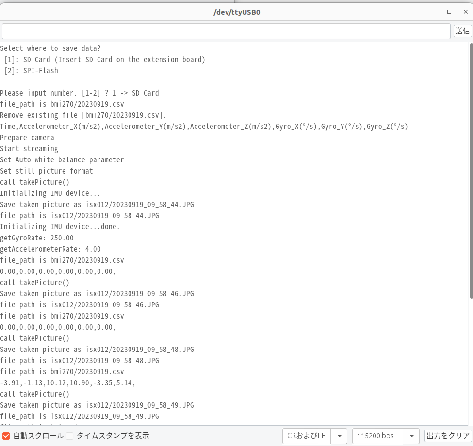
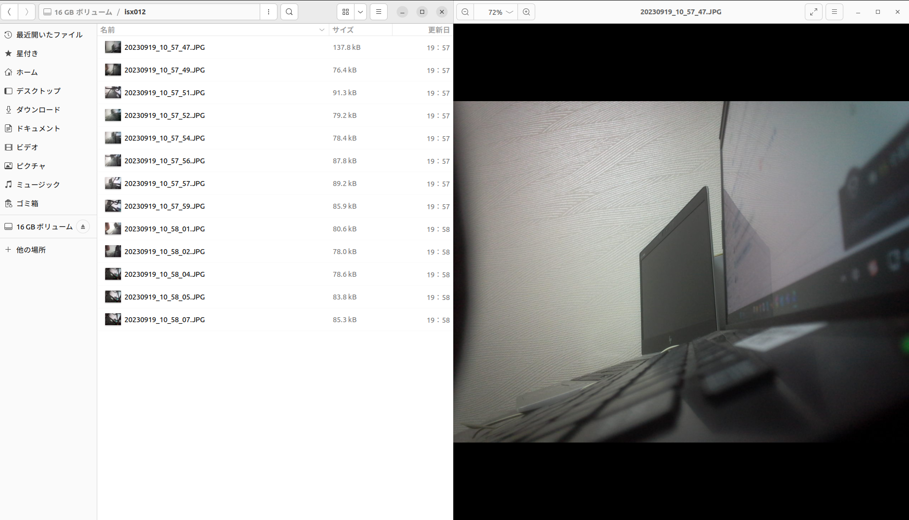
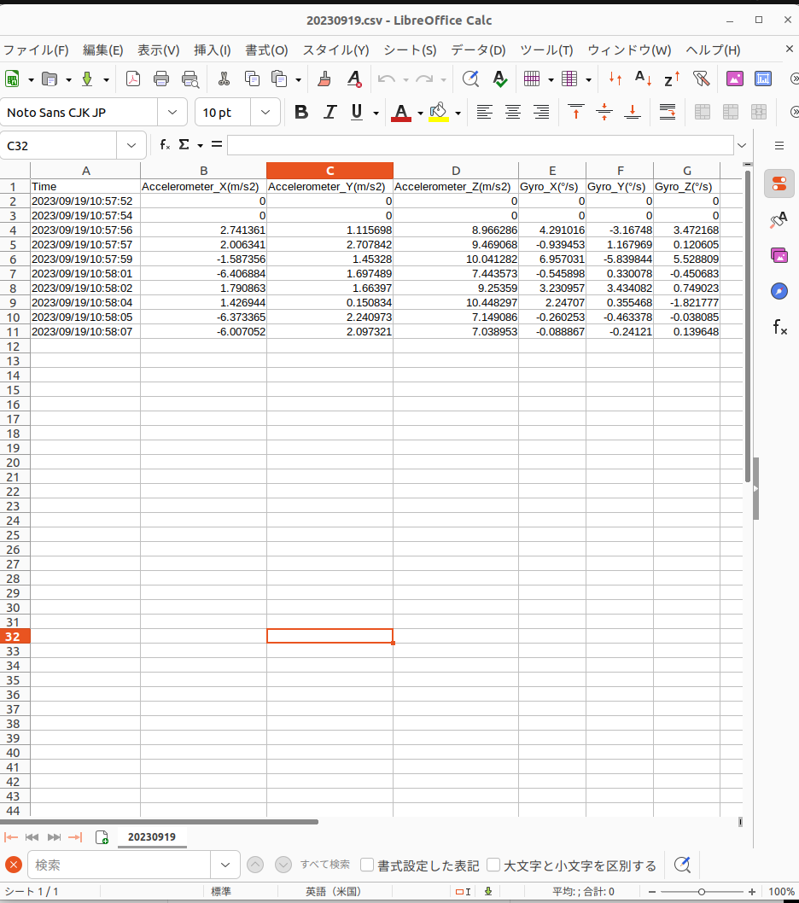

# Multi Core Sensorサンプルプログラム
カメラとBMI270センサーから同じタイミングで、それぞれ画像と3軸加速度や3軸ジャイロのデータを取得して、
FlashメモリやSDカードにjpgとcsvの形式で保存するサンプルプログラムとなります。データ取得間隔は秒単位で設定できます。
- BMI270センサーからのデータはデフォルトで取得されています。
- #define  GET_BMI270_DATAをコメントアウトして、BMI270 Sensorがなくてもカメラ画像だけ取得できます。

## 動作確認したときの環境

### 開発環境
- Arduino IDE: v1.8.19
- Spresense Arduino: v3.1.0

### 使用デバイス
- Spresense Main Board
- Spresense Extention Board
- カメラボード(ISX012)
- BMI270 Sensor(オプション)

## 事前準備
- [Spresense Arduino スタートガイド](https://developer.sony.com/develop/spresense/docs/arduino_set_up_ja.html)に記載の手順に従って環境を構築する
  ※Spresense Arduino環境インストール済みの場合は実施不要。

## ビルド方法
1. [Arduinoソースコードビルド方法](https://developer.sony.com/develop/spresense/docs/arduino_set_up_ja.html#_led_%E3%81%AE%E3%82%B9%E3%82%B1%E3%83%83%E3%83%81%E3%82%92%E5%8B%95%E3%81%8B%E3%81%97%E3%81%A6%E3%81%BF%E3%82%8B)を参照して、
[MPMainソースコード](./MPMain/MPMain.ino)と[BMI270Subソースコード](./BMI270Sub/BMI270Sub.ino)をそれぞれArduino IDEで開いてマイコンボードに書き込む ボタンをクリックして、スケッチのコンパイルと書き込みを行います。
  ※メモリサイズはDefaultでよくて、SubCoreはSubCore1を選択してください。
1. スケッチの書き込みが完了するまで待ちます。
2. スケッチの書き込みが完了すると自動的にリセットしてプログラムが起動します。

## サンプルプログラム
### 使用方法
Arduino IDEのシリアルモニタを開いて、データの保存先を選択してEnterキーを押すだけです。
|シリアルモニタを開く|保存場所を選択する|[カメラボード(ISX012)](https://developer.sony.com/develop/spresense/docs/introduction_ja.html#_spresense_%E3%82%AB%E3%83%A1%E3%83%A9%E3%83%9C%E3%83%BC%E3%83%89)画像を確認する|csvファイルを確認する|
|----|----|----|----|
|||||

(注1)起動するとデータのファイル書き込みが続きます。終了するには[Spresenseの[RST] Reset button](https://developer.sony.com/develop/spresense/docs/introduction_ja.html)を押してください。 
(注2)データを取得再開する場合、前のファイルを上書きするため、ファイルをバックアップしてからデータを取得してください。

### 操作方法
Arduino IDEのシリアルモニタを開いている状態で、以下のキーを入力することで操作が可能
|入力キー|動作|
|----|----|
|1＋Enterキー|データをSDカードに保存する|
|2＋Enterキー|データをFlashメモリに保存する|

### FlashメモリとSDカード共通
[Zmodem を使ってPCにファイル転送](https://developer.sony.com/develop/spresense/docs/sdk_tutorials_ja.html#_tips_zmodem)に記載の手順に従ってファイルをPCで確認できます。

### SDカードのみ
- 方法1：SDカードに対応したPCであれば手動でSDカードをPCに差し込んで確認できます。
- 方法2：[UsbMscサンプルプログラムを使ってファイル確認](../../Arduino/KLMAG1JETD-B041/UsbMsc/README.md)に記載の手順に従ってファイルをPCで確認できます。

## 参考ページ
- [Spresense Arduino スタートガイド](https://developer.sony.com/develop/spresense/docs/arduino_set_up_ja.html)
- [Zmodem を使ってPCにファイル転送](https://developer.sony.com/develop/spresense/docs/sdk_tutorials_ja.html#_tips_zmodem)
- [UsbMscサンプルプログラムを使ってファイル確認](../../Arduino/KLMAG1JETD-B041/UsbMsc/README.md)

## 変更履歴
|バージョン|リリース日|変更概要|
|----|----|----|
|0.1|2023/09/22|内部リリース|

