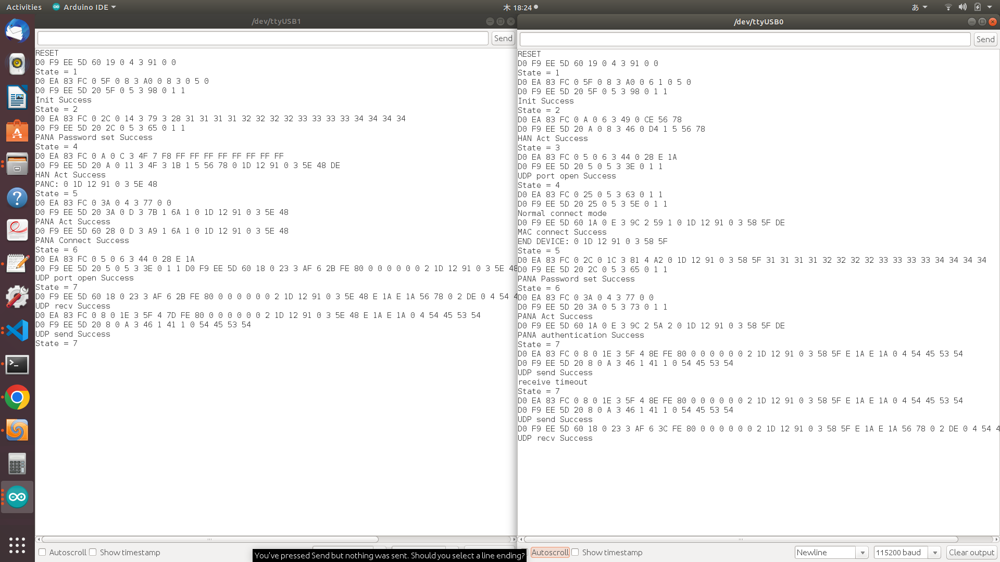
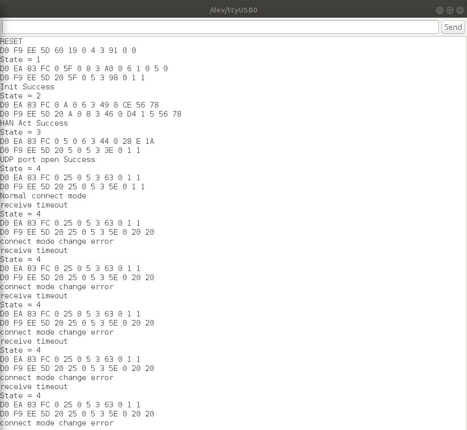
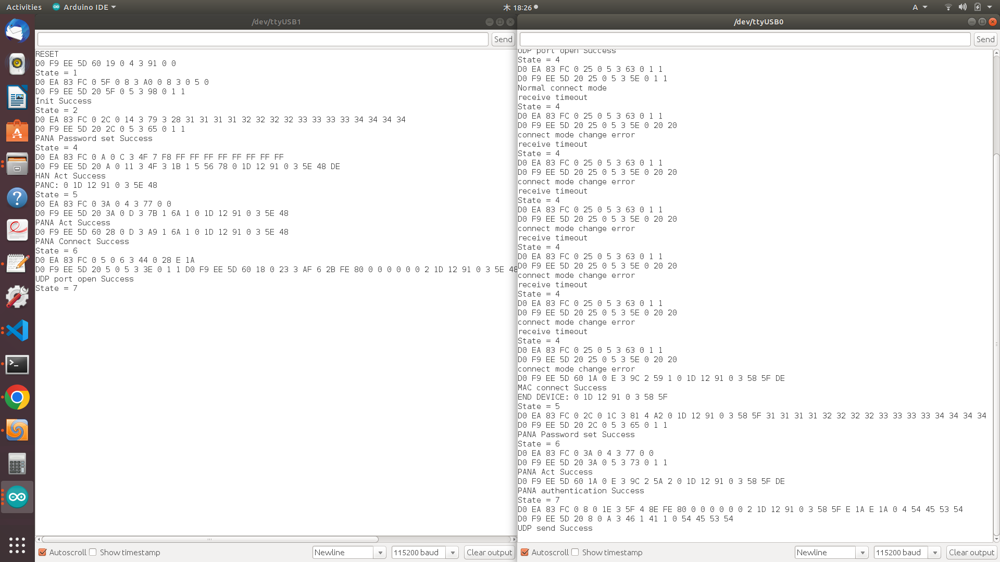

# BP35C0-J11サンプルプログラム

本サンプルは、 ２つの[Wi-SUN Add-on(BP35C0-J11)ボード](https://www.rohm.co.jp/support/spresense-add-on-board)を使用して、片方はPAN コーディネータ(HAN)、もう片方はエンドデバイス(HAN)として1V1でUDPを経由してデータ送受信を行います。

## 動作確認したときの環境
### 開発環境
- PC: Ubuntu 18.04 または Windows 11
- Arduino IDE:v1.8.13/v2.1.0
- Spresense Arduino:v2.6.0/v3.0.0

### 使用デバイス
- Spresense Main Board(２つ)
- Wi-SUN Add-on(BP35C0-J11)ボード(２つ)

## 事前準備
- [Spresense Arduino スタートガイド](https://developer.sony.com/develop/spresense/docs/arduino_set_up_ja.html)に記載の手順に従って環境を構築します。なお、Spresense Arduino環境インストール済みの場合は実施不要です。

- エンドデバイス側のソースコードを準備します。

|①ライブラリ及びサンプルをダウンロードする|②dev_diff.patchファイルを適用してソースコードを修正する|③ライブラリをサンプルと同一フォルダに移動する|
|----|----|----|
|//devフォルダを作成して移動する mkdir dev && cd dev git clone https://github.com/RohmSemiconductor/Arduino.git|//①でダウンロードしたフォルダに移動する cd hogehoge/Arduino //dev_diff.patchファイルをコピーする cp ~/hogehoge/ssup-spresense/resources/WISUN-EVK-701/samples/communication_1v1/dev_diff.patch . //dev_diff.patchファイルの差分をソースコードに反映する patch -p1 < [dev_diff.patch](dev_diff.patch)<code>|<code>mv SPRESENSE-WISUN-EVK-701/bp35c0-j11.* SPRESENSE-WISUN-EVK-701/examples/SPRESENSE-WISUN-EVK-701/|

- PAN コーディネータ側のソースコードを準備します。

|①ライブラリ及びサンプルをダウンロードする|②pan_diff.patchファイルを適用してソースコードを修正する|③ライブラリをサンプルと同一フォルダに移動する|
|----|----|----|
|//panフォルダを作成して移動する mkdir pan && cd pan git clone https://github.com/RohmSemiconductor/Arduino.git|//①でダウンロードしたフォルダに移動する cd hogehoge/Arduino //dev_diff.patchファイルをコピーする cp ~/hogehoge/ssup-spresense/resources/WISUN-EVK-701/samples/communication_1v1/pan_diff.patch . //pan_diff.patchファイルの差分をソースコードに反映する patch -p1 < [pan_diff.patch](pan_diff.patch)<code>|<code>mv SPRESENSE-WISUN-EVK-701/bp35c0-j11.* SPRESENSE-WISUN-EVK-701/examples/SPRESENSE-WISUN-EVK-701/|

## ビルド方法
1. [Arduinoソースコードビルド方法](https://developer.sony.com/develop/spresense/docs/arduino_set_up_ja.html#_led_%E3%81%AE%E3%82%B9%E3%82%B1%E3%83%83%E3%83%81%E3%82%92%E5%8B%95%E3%81%8B%E3%81%97%E3%81%A6%E3%81%BF%E3%82%8B)を参照して、
それぞれエンドデバイス側のSPRESENSE-WISUN-EVK-701.inoとPAN コーディネータ側のSPRESENSE-WISUN-EVK-701.inoをArduino IDEで開いてマイコンボードに書き込む ボタンをクリックして、スケッチのコンパイルと書き込みを行います。
2. スケッチの書き込みが完了するまで待ちます。
3. スケッチの書き込みが完了すると自動的にリセットしてプログラムが起動します。

## サンプルプログラム

### 動作例
|動作例|
|----|
||

### 使用方法
- 先にPAN コーディネータのシリアルモニタを開く、エンドデバイス接続を待ちます。
- 次にエンドデバイスのシリアルモニタを開く、双方向通信を確認します。

|先にPAN コーディネータのシリアルモニタを開く、エンドデバイス接続を待ち|次にエンドデバイスのシリアルモニタを開く、双方向通信を確認|
|----|----|
|||

### 操作方法
特に不要。

### 確認方法
シリアルモニタにてログを確認します。
- 2022/12/23に特に問題がないことを動作確認済み。

## 参考ページ
- [Spresense Arduino スタートガイド](https://developer.sony.com/develop/spresense/docs/arduino_set_up_ja.html)
- [BP35C0-J11 UART IF仕様書](https://fscdn.rohm.com/jp/products/databook/applinote/module/wireless/bp35c0-j11_uartif_specification_tr-j.pdf)

## 変更履歴
|バージョン|リリース日|変更概要|
|----|----|----|
|v0.1|2022.08.05|初版|
|v0.2|2022.12.23|Spresense Arduino:v2.6.0で動作確認及びドキュメント更新|
