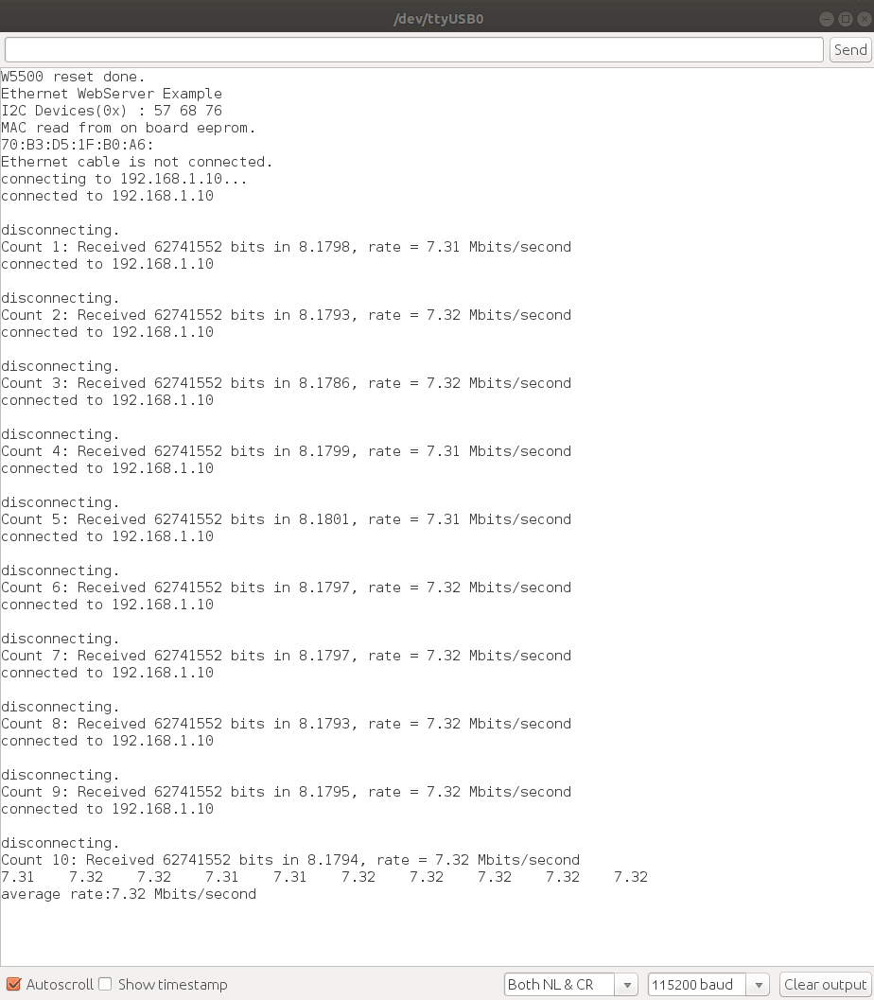

<div align="right">
<a href="https://developer.sony.com/ja/develop/ssup/"></a>
</div>

# W5500サンプルプログラム

本サンプルは、 [W5500-Ether for Spresense](https://crane-elec.co.jp/products/oem/vol-20/)を使用してHTTPリクエストを作成する方法を示しています。 そして、Spresenseはサーバーから対象物をDownloadして、繰り返して10回スピードを測定を行います。

## 動作確認したときの環境

### 開発環境
- PC: Ubuntu 18.04
- Arduino IDE: v1.8.13
- Spresense Arduino: v2.6.0

### 使用デバイス
- Spresense Main Board
- W5500-Ether Add-onボード
- LANケーブル

### ライブラリ
- [W5500 library](https://crane-elec.co.jp/wp/wp-content/uploads/2022/03/Ethernet-spi5.zip)

## 事前準備
- [Spresense Arduino スタートガイド](https://developer.sony.com/develop/spresense/docs/arduino_set_up_ja.html)に記載の手順に従って環境を構築します。なお、Spresense Arduino環境インストール済みの場合は実施不要です。

- 最初にソースコードをコンパイルするときに、Arduino IDEインストールされた場所(hogehoge/Arduino/libraries/Ethernet)にEthernetライブラリがありますが、今回Spresense向けの[W5500 library](https://crane-elec.co.jp/wp/wp-content/uploads/2022/03/Ethernet-spi5.zip)とコンフリクトするため、手動で削除してください。
- [W5500 library](https://crane-elec.co.jp/wp/wp-content/uploads/2022/03/Ethernet-spi5.zip)をインストールします。Spresense Arduinoライブラリのインストール方法は[こちら](https://github.com/SonySemiconductorSolutions/ssup-spresense-internal/blob/main/FAQ.md#arduino%E3%83%A9%E3%82%A4%E3%83%96%E3%83%A9%E3%83%AA%E3%82%92%E3%82%A4%E3%83%B3%E3%82%B9%E3%83%88%E3%83%BC%E3%83%AB%E3%81%99%E3%82%8B%E6%96%B9%E6%B3%95)をご参照ください。既にインストール済みの場合は実施不要です。

## ビルド方法
1. [Arduinoソースコードビルド方法](https://developer.sony.com/develop/spresense/docs/arduino_set_up_ja.html#_led_%E3%81%AE%E3%82%B9%E3%82%B1%E3%83%83%E3%83%81%E3%82%92%E5%8B%95%E3%81%8B%E3%81%97%E3%81%A6%E3%81%BF%E3%82%8B)を参照して、
[webClient.ino](./webClient.ino)をArduino IDEで開いてマイコンボードに書き込む ボタンをクリックして、スケッチのコンパイルと書き込みを行います。
2. スケッチの書き込みが完了するまで待ちます。
3. スケッチの書き込みが完了すると自動的にリセットしてプログラムが起動します。
  - ※"arduino.h: No such file or diretory"エラーが発生した場合、#include "arduino.h"を削除してビルドしてください。
  
## サンプルプログラム
### 動作例
|シリアルモニタを開くだけ|
|----|
||

### 使用方法
[config.h](./config.h)を開いて、実際の環境に合わせて、下記のコンフィグレーションを変更します。
```
/* サーバーアドレスに変更してください */
#define HTTP_HOST_NAME          "192.168.1.9"
/* HTTP GETのサーバー上のファイルパスにを変更してください */
#define HTTP_GET_FILE_PATH      "GET /myexample.com/test1.json HTTP/1.1"
```
[webClient.ino](./webClient.ino)を開いて、実際の環境に合わせて、下記のクライアントIPを変更します。
```
/* クライアントのIPをサーバーのIPと同じネットワークに変更してください */
IPAddress ip(192, 168, 1, 11);
```

### 操作方法
特に不要。

### 確認方法
シリアルモニタにてログを確認します。
- 2022/12/22に特に問題がないことを動作確認済み。

## 参考ページ
- [Spresense Arduino スタートガイド](https://developer.sony.com/develop/spresense/docs/arduino_set_up_ja.html)
- [W5500 library](https://crane-elec.co.jp/wp/wp-content/uploads/2022/03/Ethernet-spi5.zip)
- [Downloadスピード測定方法](https://docs.arduino.cc/tutorials/Ethernet-shield-rev2/web-client)

## 変更履歴
|バージョン|リリース日|変更概要|
|----|----|----|
|v0.1|2022.06.27|初版|
|v0.2|2022.09.09|W5500ライブラリを一本化するようにフォルダ構成を修正|
|v0.3|2022.12.23|Spresense Arduino:v2.6.0で動作確認及びドキュメント更新|
