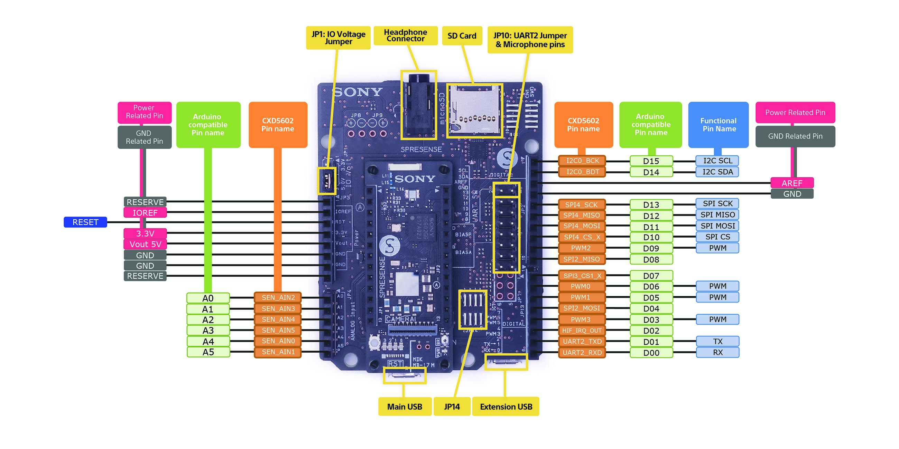
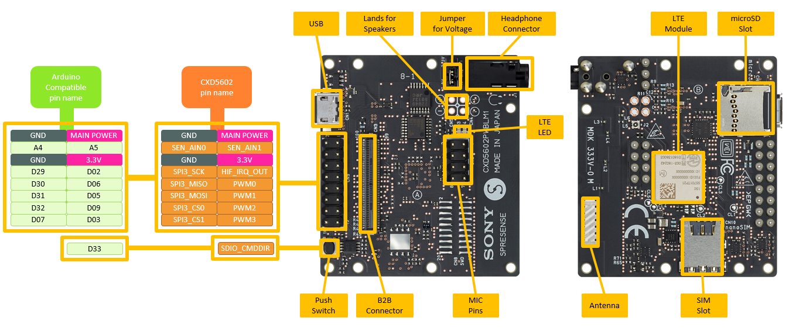

# FAQ

本文書内の実測値等はあくまで参考値となりますので予めご了承ください。

## Spresenseメインボード

### ピンレイアウト


[Spresenseメインボード](https://developer.sony.com/develop/spresense/docs/introduction_ja.html#_spresense_%E3%83%A1%E3%82%A4%E3%83%B3%E3%83%9C%E3%83%BC%E3%83%89)より

## 拡張ボード

### ピンレイアウト



## LTE拡張ボード

### ピンレイアウト



## GitHubのリポジトリからファイルをダウンロードする方法

### ZIPファイルとしてダウンロードする方法

GitHubのリポジトリをZIPファイルとしてダウンロードする手順は以下の通りです。

1. ダウンロードしたいリポジトリのページに移動する。
2. 画面の右側の緑色の「Code」を選択する。
3. 「Code」を選択したら「Download ZIP」を選択する。

「Download ZIP」を選択したら、ZIPファイルがダウンロードされます。

### gitコマンドを用いてダウンロードする方法

GitHubのリポジトリをコマンドラインでダウンロードする手順は以下の通りです。

1. ダウンロードしたいリポジトリのページに移動する。
1. 画面の右側の緑色の「Code」を選択する。
1. 「Code」を選択したら「HTTPS」か「SSH」か「GitHub CLI」のいずれかを選択する。通常は「HTTPS」を選択すると良い。
1. 「HTTPS」を選択したら、`git clone https://github.com/{ユーザ名}/{リポジトリ名}.git` が表示されるのでコピーします（urlの右側のアイコンをクリックするとリンク全てをコピーできます）。
1. ターミナルよりコピーしたコマンドを実行すると、コマンドを実行したディレクトリにリポジトリがダウンロードされます。

```bash
 $ git clone git clone https://github.com/{ユーザ名}/{リポジトリ名}.git
```

## Arduinoライブラリをインストールする方法

Arduinoライブラリのインストール方法は、[こちら](https://docs.arduino.cc/software/ide-v1/tutorials/installing-libraries)をご覧ください。なお、各センサーやアドオンボードなどのArduinoライブラリは、主に[GitHub](http://github.com/)にて提供されています。[Library Specification](https://arduino.github.io/arduino-cli/0.29/library-specification/)の[layout of folders and files](https://arduino.github.io/arduino-cli/0.29/library-specification/#layout-of-folders-and-files)に準拠したライブラリは、[Importing a ZIP library](https://docs.arduino.cc/software/ide-v1/tutorials/installing-libraries#importing-a-zip-library)または[Manual Installation](https://docs.arduino.cc/software/ide-v1/tutorials/installing-libraries#manual-installation)でインストール出来ます。なお、ArduinoライブラリはGitHubで提供されていることが多いです。ダウンロード方法ついては[こちら](#githubのリポジトリからファイルをダウンロードする方法)を参考にしてください。

|「.ZIP形式のライブラリをインストールする」を選択する|フォルダもしくはZIPファイルの場所を選択する|
|----|----|
|||

## スケッチ＆ライブラリ用ディレクトリ

スケッチディレクトリは、新しく作成したスケッチのデフォルトの保存先になっています。また、スケッチディレクトリ内のlibrariesディレクトリには新しく追加したライブラリが保存されます。なお、保存先は、Arduino IDEの設定で変更することが出来ます。

| OS | スケッチディレクトリ | ライブラリディレクトリ |
|----|----|----|
| Windows | `C:\Users\{ユーザー名}\Documents\Arduino` | `C:\Users\{ユーザー名}\Documents\Arduino\libraries` |
| Mac OS | `/Users/{ユーザー名}/Documents/Arduino` | `/Users/{ユーザー名}/Documents/Arduino/libraries` |
| Linux | `/home/{ユーザー名}/Arduino` |  `/home/{ユーザー名}/Arduino/libraries` |

## Gitリポジトリ内のサブディレクトリをZIP圧縮する方法

git archiveコマンドを使用することでリポジトリ内のサブディレクトリをZIP圧縮することが出来ます。

```bash
$ git clone https://github.com/SonySemiconductorSolutions/ssup-spresense
$ cd ssup-spresense
$ git archive HEAD:Arduino/MM-S50MV -o MM-S50MV.zip
```

## SDカード

### SDカードを挿入しても認識しない

SDカードがうまく動作ときは下記の可能性があります。

1. メインボードと拡張ボードのコネクタが半差しになってうまく接続されていない
2. SDカードが認識できないフォーマットでフォーマットされている。

(1)	については、一度、メインボードを上から押しこんでみてください。表面上はうまく接続
されているように見えますが、接続がうまくいっていなことがあります。

(2)	については、SDカードがFAT32でフォーマットされているかご確認ください。

他の要因の可能性もありますが、まずは、上記2点についてご確認をお願いいたします。

## [カメラボード(CXD5602PWBCAM1)](https://developer.sony.com/develop/spresense/docs/introduction_ja.html#_spresense_%E3%82%AB%E3%83%A1%E3%83%A9%E3%83%9C%E3%83%BC%E3%83%89)

### フレームレートを教えてほしい。

フレームレートは取得する画像のサイズやフォーマットによって変わってきます。例えば、[こちら](https://github.com/sonydevworld/spresense-arduino-compatible/blob/master/Arduino15/packages/SPRESENSE/hardware/spresense/1.0.0/libraries/Camera/examples/hfr_jpg/hfr_jpg.ino)は、5秒間分のQVGA(320x240)の120fpsのストリームをJPEGでSDカードに書き込むプログラムになります。このプログラムhfr_jpg.inoの画像サイズやフレームレート等については、setup()内部のtheCamera.begin()の引数を変更してください。また、保存時間については、#define FRAMES_NUM を変更してください。なお、SDカードのメーカーや使用状況によっては１フレーム内にSDカードへの書き込み処理が終わらず、想定しているフレームレートが出ない可能性もあります。予めご了承ください。

また、hfr_jpg.inoは、QVGAの画像サイズですが、例えばQUAD-VGA(1280x960)などに画像サイズの場合は、下記のように変更すると30fpsくらいのフレームレートで画像を取得することが出来ます。
```C
theCamera.begin(2,
               CAM_VIDEO_FPS_30,
               CAM_IMGSIZE_QUADVGA_H,
               CAM_IMGSIZE_QUADVGA_V,
               CAM_IMAGE_PIX_FMT_JPG,
               14
               );
```
その他、画像サイズや画像フォーマットを変更した際のフレームレートについては、パラメータを変更して試してみてください。

### カメラで撮影したVGA画像を30fps以上でSDカードに記録したい。

SDカード上の同一ディレクトリの画像ファイル数が増えてくるとフレームレートの低下が発生し30fpsでは保存できなくなります。これを回避するために、以下の2つの方法を試してみたところ、試した範囲ではほぼ30fpsのフレームレートで保存することが出来ましたのでご紹介しておきます。

**1つのフォルダに200枚毎の画像を保存する。**

現在は、仮に200枚としていますが、

1. 1つのフォルダに200枚の画像を保存する。
2. 200枚になったら新しいフォルダに200枚保存する。

といった方法で1つのフォルダに保存する枚数を抑えて記録するとフレームレートがほぼ30fpsで保存することが出来るようです。

**Motion JPEG (AVI)フォーマットで画像を保存する。**

下記のライブラリを使用して、10分間程度AVIフォーマットで保存したところファイルサイズ約130MBでほぼ30fpsの動画を保存することが出来るようです。

[AviLibrary_Arduino](https://github.com/YoshinoTaro/AviLibrary_Arduino)

もし、必要であれば、ffmpeg等を用いて後からPC上で一枚毎JPEGファイルに切り出すのは可能かと思います。

### カメラで撮影したHD画像を30fps以上でネットワークを介して送信したい。

Spresense本体に通信のAddonボードを接続した際、データ通信で使用しているSPIの最大レートが13Mbpsとなります。このため、SPIの最大レートに近いスピードが出せる有線LANを使用してもHD画像を30fpsの送信することは出来ません。

## [HDRカメラボード(CXD5602PWBCAM2W)](https://developer.sony.com/develop/spresense/docs/introduction_ja.html#_spresense_hdr_%E3%82%AB%E3%83%A1%E3%83%A9%E3%83%9C%E3%83%BC%E3%83%89)

### カメラボードとHDRカメラボードの違いは何か？

HDRカメラボードはオンチップの複数フレームデジタル重畳技術によってHDRイメージセンシング（120dB）に対応します。カメラボードでは対応が難しかった暗所や逆光などの明暗差の大きい環境でもクリアな映像が得られます。


## [Spresense SDKオーディオチュートリアル](https://developer.sony.com/develop/spresense/docs/sdk_tutorials_ja.html#_audio_%E3%83%81%E3%83%A5%E3%83%BC%E3%83%88%E3%83%AA%E3%82%A2%E3%83%AB)

### audio_playerサンプルを実行し、音声ファイルを再生すると再生速度が速い。

再生するために用意した音声ファイル情報が記載されたplaylistファイル TRACK_DB.csv にチャンネル情報の記入が必要です。詳細についてはaudio_playerサンプルのReadMeファイルを参考してください。

### audio_recorderサンプルにおいて、SDカードを使用した録音がうまくいかない。

オーディオの使用についてはいくつか注意事項があります。下記についてご確認ください。

- ビット長を24ビットに設定した場合、ハイレゾモードに設定しなければなりません。ハイレゾモードに設定していない場合には、[0x16エラー]( https://developer.sony.com/develop/spresense/docs/sdk_developer_guide_ja.html#_as_ecode_command_param_bit_length)が発生します。

- バッファオーバーフローエラーが発生する場合は、ソースコードのSTDIO_BUFFER_SIZEを再設定する必要があります。

## [LTE拡張ボード(CXD5602PWBLM1JUL)](https://developer.sony.com/develop/spresense/docs/hw_docs_lte_ja.html)

### LTE拡張ボードが上手く動作しない。

送受信が上手くいかなかったり、途中で通信が切れてしまうなどが発生する際には、電波状況だけではなくSpresense SDKの不具合の可能性もあります。LTE拡張ボードを利用する際には、不具合の改善がされていることがあるので[リリースノート](https://developer.sony.com/develop/spresense/docs/release_sdk_ja.html)をご確認の上なるべく最新版に近いSDKをご利用ください。 

## [WiFiアドオンボード(THOUSANDIY-005)](https://thousandiy.wordpress.com/2018/10/07/wi-fi-add-on-board-for-spresense/)

### Spresense SDKで使えますか？
THOUSANDIY-005で使用しているESP-WROOM-02はESP8266EXを搭載を搭載していますが、Spresense SDKは現在ESP8266に対応していないためSpresense SDKでの使用はできません。
Arduinoから使用した場合のみ使用可能となります。

## [WiFiアドオンボード(iS110B)](https://idy-design.com/product/is110b.html)

### 無線LANのアクセスポイントとの接続が出来ない

無線LANのアクセスポイントとの接続が出来ず、Association Failsなどのエラーが発生するケースとしてはいくつかが考えられます。

1. Spresenseとアドオン基板の接触が良くない。このときは、Spresenseとアドオンボードを強めに押さえて接続できないか試してみてください。
2. AP_SSIDの値が使用したい無線LANのアクセスポイントと異なっている。このときは、無線LANのアクセスポイントのSSIDと異なっていないか確かめてみてください。
3. PASSPHRASEの値が使用したい無線LANのアクセスポイントと異なっている。このときは、無線LANのアクセスポイントのPASSPHRASEと異なっていないか確かめてみてください。
4. まれにボードを挿しこんだ時の接触が悪い時があるようです。手で押さえていると動作するか確かめてみてください。

## [ELTRES](https://www.sony-semicon.com/ja/eltres/index.html)

### ELTRESの電波到達距離が100km以上になる場合の測定条件

ELTRESの電波到達距離が100km以上になる際の条件は、

1. 送信点が地上または海面等から十分に高い
2. 受信点が標高1000m以上と十分に高い

のように、地球の曲率を考慮して送信点から受信点が見通しになっていること、および、

3. 電波が伝搬する際のフレネルゾーンに地面・海面が掛からない

となります。この条件に合わない場合は到達距離は短くなると思ってください。また、ELTRESを雨や海水の水滴がかかるような環境で使用する際には電波が散乱・吸収されるため通信に影響が出ます。

### 通信について

ELTRESはGNSSを受信開始してから受信局との間で同期できる時刻精度になったら通信します。GNSSの受信ができない環境では通信できません。なお、GNSS受信してから時刻同期までは40秒ほど必要になります。

## [Wi-SUN Add-on Board(SPRESENSE-WISUN-EVK-701)](https://www.rohm.co.jp/support/spresense-add-on-board)

開発ドキュメント：
https://www.rohm.co.jp/products/wireless-communication/specified-low-power-radio-modules/bp35c0-j11-product#documentationSubMenu

### SPRESENSE-WISUN-EVK-701による1対1ネットワーク

SPRESENSE-WISUN-EVK-701のみでネットワークを構築することが可能です。
参考資料としてSPRESENSE-WISUN-EVK-701で1対1のネットワークを構築し、データ送受信を行うサンプルプログラムは[こちら](./resources/WISUN-EVK-701)になります。

### PANコーディネータとしてBP35C2を使用したネットワーク

サンプルプログラムの動作説明書は[こちら](https://github.com/RohmSemiconductor/Arduino/blob/master/SPRESENSE-WISUN-EVK-701/documents/SPRESENSE-WiSUN-EVK-701_%E3%82%B5%E3%83%B3%E3%83%97%E3%83%AB%E3%82%BD%E3%83%95%E3%83%88%E3%82%A6%E3%82%A7%E3%82%A2%E8%AA%AC%E6%98%8E%E6%9B%B8_ROHC.pdf)、
サンプルプログラムは[こちら](https://github.com/RohmSemiconductor/Arduino/tree/master/SPRESENSE-WISUN-EVK-701)になります。

## モバイルバッテリ駆動について

### モバイルバッテリを使用すると数秒で切れてしまう
Spresenseは低電流のため通常のスマートフォン用モバイルバッテリを使用すると数秒で電力供給が切れてしまうことがあります。もし、すぐに電力供給が切れてしまうようでしたらIoT対応や低電流モード等をサポートしたモバイルバッテリを試してみてください。

## Flashメモリ

### Flashメモリにデータを記録する際、記録されたりされなかったりと不安定になることがあります。原因は何でしょうか？

#### 考えられる原因
Flashメモリへのデータ書き込み中に瞬断(電源OFFやリセット)が入ると、データが中途半端に書かれ、ファイル管理領域との整合性が取れない状態になります。そして、次の起動時にfile system check処理が走り、この中途半端な異常ファイルを検知すると、そのファイルを削除しにいく処理が走ります。これはファイルシステムの整合性を保つために必要な処理になります。Flashメモリへのデータの書き込みが不安定なのは、一連のオペレーションの中でデータをファイルに書き込んでいる途中で意図せずリセットが入ってしまっているのではないかと予想します。

例えば、常時、”data.txt”にデータを書き込んでいる場合、タイミング悪く、USBを抜き差ししたり、リセットボタンを押したり、シリアルモニタを開いたりすると、この瞬断が発生して次の起動でファイルが消去されます。

対策としては、以下の方法が考えられます。

#### 対策1
dataFileへの書き込みを細切れにせずにできるだけ一度に書き込むようにします。

変更前
```C
    dataFile.print(sframe);
    dataFile.print(",");
    dataFile.print("X");
    dataFile.print(",");
    dataFile.print("Y");
    dataFile.print(",");
    dataFile.println("Z");
```

変更後
```C
    len = sprintf(buf, "%ld,X,Y,Z\n", sframe);
    dataFile.write(buf, len);
```

また、サンプルごとにFlashに書きこむのではなく、複数サンプルのデータをバッファに溜めておいてから、まとめて一度に書き込む方が効率が良くなります。
 
#### 対策2 

常に"data.txt"に追加書き込みをするのではなく、ある程度書き込んだら書き込むファイル名を変更します。

#### 対策3
 
起動した直後にファイルを書き込むのは止めて、ある程度の時間を置いてからファイル書き込み処理を行うようにWaitを入れます。

#### 対策4

その他、Flashメモリへの書き込み中にリセットが入らないような仕組みを検討してみてください。

## マルチコア

### サブコアで音の出力を制御したい

現状、ソフトウエアの制約によりオーディオのハードウエアの制御はメインコアからしか出来ず、音出力の処理はメインコアで行う必要があります。対応にはソフトウエアのベースのところからの修正が必要とのことで、今のところソフトウエアの修正の予定はありません。

### MP.Recv()側のプログラムがassertする

送信バッファおよび受信バッファは、内部でそれぞれ8つ分のバッファを持っており、Recv()が呼ばれずに受信バッファがいっぱいの状態になると、システムは異常状態と判断してプログラムはassertします。このassertが発生した場合には、受信側のコアが正しく動作していない、または、負荷が高すぎるなどの可能性が考えれます。

[コア間通信方法](https://developer.sony.com/develop/spresense/docs/arduino_developer_guide_ja.html#_mp_communication)

### コア間通信のアドレス渡しで値が取れない

コア間通信のアドレスとしてローカル変数を使用すると、関数を抜けた際にメモリが解放されるため上手く値を渡せません。例えば、
```C
void func()
{
  double a = 2.0;
  MP.Send(0, &a);
}
```

のようにローカル変数を指定すると、func()を抜けた後、ローカル変数aが使用しているメモリは解放されてしまうため、MP.Recv()で受信したアドレスは既に解放されていることが多いです。アドレス渡しで使用する変数には、グローバル変数やヒープなどのメモリを使用してください。

### MP通信の受信バッファの段数を変更したい。

MP通信は8段の受信バッファを持っていますが、Arduinoが提供しているAPIで受信バッファの段数を変更できません。

## GPIO割込み

### APP GPIOで6本目の設定ができない

APP GPIOは最大6本まで使用できますが、SDカードの抜き差し検出用に1本使用するため、拡張ボードを使用する際には5本しか使用できません。

[attachInterrupt()](https://developer.sony.com/spresense/development-guides/arduino_developer_guide_ja.html#_attachinterrupt)

## 2台のSpresense間で通信を行いたい

### ピンの関係で通常のシリアルやWiFiなどが使用できない

Arduinoでは、[Software Serial Library](https://developer.sony.com/spresense/development-guides/arduino_developer_guide_ja.html#_software_serial_%E3%83%A9%E3%82%A4%E3%83%96%E3%83%A9%E3%83%AA)が提供されています。Software Serialが使用できないか検討してみてください。

## 各I/Oの最大通信速度

|I/O |最大通信速度 |
|----|----|
|SPI5(メインボード)| 13Mbps(Tx & Rx mode) |
|SPI4(拡張ボード) | 39Mbps(Tx mode), 9.750Mbps(Tx & Rx mode) |
|SPI(LTE拡張ボード)| 6.5Mbps |
|SDIO | 21MB/s |
|UART| 1.8432Mbps |
|I2C|400kbps|

SPIについては、メインボードおよび拡張ボードのどちらもTx & Rx modeではデータレートがおよそ10Mbps前後となっており、通信チップの性能に関わらず、10Mbps辺りが通信速度の上限となりますのでご注意ください。

## 外部サイトのIPアドレスを調べる方法

いろいろな方法がありますが、Google Admin Toolboxが提供しているサービスを使用するとWebブラウザからOS非依存で調べることができます。

- [Dig (DNSルックアップ)](https://toolbox.googleapps.com/apps/dig/)

## Spresenseで利用可能な数値計算ライブラリ

Arduino向けにEigenArudinoというmatrix/vectorライブラリがあります。

- [EigenArduino](https://github.com/vancegroup/EigenArduino)

以下をダウンロードしてArduino IDEでインストールして試してみてください。

- [https://github.com/vancegroup/EigenArduino/archive/refs/heads/Eigen30.zip](https://github.com/vancegroup/EigenArduino/archive/refs/heads/Eigen30.zip)

## DCモータの駆動方法

SpresenseのデジタルI/O(D00～D15)ですが電圧は5Vになりますが、電流が6mA程度となり、DCモータを直接接続して回すには電流が足りません。

- [SpresenseとArduino UNOの違い](https://developer.sony.com/ja/spresense/development-guides/hw_docs_ja.html#_spresense_%E3%81%A8_arduino_uno_%E3%81%AE%E9%81%95%E3%81%84)

モータドライバを使用して動作させている例がありますので、こちらをご参考にして頂ければと思います。

- [SPRESENSE メインボードでDCモータを動かしてみた！](https://makers-with-myson.blog.ss-blog.jp/2020-03-08)
