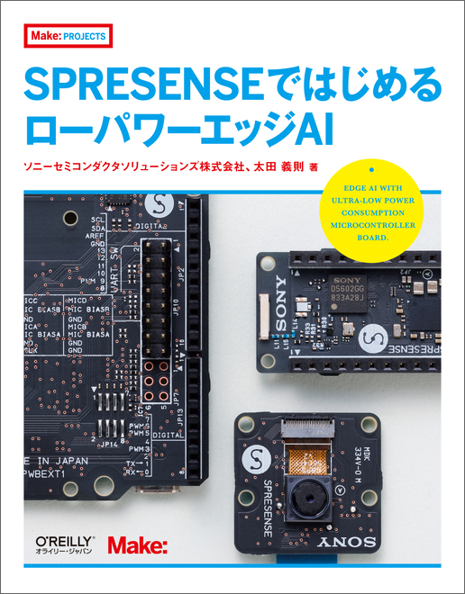

# Spresenseサポート

## 0.利用上の注意
本サイトの情報は参考情報であり、お客様が本サイトに記載された情報を元に行ったことによって生じる損害についてソニーセミコンダクタソリューションズ株式会社は一切の責任を負いません。なお、この注意書きはお客様の法律上の権利を制限するものではありません。 
以上をご了承いただき、本サイトの情報をご利用ください。

## 1.はじめに

Spresenseについては[公式ドキュメント](https://developer.sony.com/ja/develop/spresense/)をご覧ください。また不明点が出てきた時には[公式FAQ](https://developer.sony.com/develop/spresense/docs/faq_ja.html)、[SSUP版FAQ](FAQ.md)、[stackoverflow](https://ja.stackoverflow.com/questions/tagged/spresense)などをご覧ください。

- [Spresenseについて](https://developer.sony.com/develop/spresense/docs/introduction_ja.html)
- [Spresenseドキュメント](https://developer.sony.com/spresense/development-guides/home_ja.html)
- [Spresense Arduinoリリースノート](https://developer.sony.com/develop/spresense/docs/release_arduino_ja.html)
- [Spresense SDKリリースノート](https://developer.sony.com/develop/spresense/docs/release_sdk_ja.html)

## 2.トピックス

- [Sensing Solutionアイデアソン・ハッカソン](https://sensing-solution-hackathon.sonyged.com/hc/ja)
- [2023年 SPRESENSE(TM)活用コンテスト](https://elchika.com/promotion/spresense2023/)
- [spresense Advent Calendar 2022](https://qiita.com/advent-calendar/2022/spresense)
- [spresense Advent Calendar 2021](https://qiita.com/advent-calendar/2021/spresense)
- [Daion Watch - MB専攻が実現する“未来の音楽体験”とは？](https://www.daion.ac.jp/muse/daion-watch/dmt2022/)
- [hackster.io (spresense)](https://www.hackster.io/search?i=projects&q=spresense)
- [qiita.com (spresense)](https://qiita.com/search?q=spresense)
- [elchika.com (spresense)](https://elchika.com/tag/spresense/)
- [stackoverflow.com (spresense)](https://ja.stackoverflow.com/questions/tagged/spresense)
- [protopedia.net (spresense)](https://protopedia.net/keyword?word=spresense)
- [aps-web.jp (spresense)](https://www.aps-web.jp/?s=spresense)

## 3.Spresense Arduino

Spresense Arduinoを使用する開発では[Arudino IDE](https://www.arduino.cc/en/software)を使用することが出来ます。はじめてセットアップする際には[Spresense Arduinoスタートガイド](https://developer.sony.com/develop/spresense/docs/arduino_set_up_ja.html)をご覧ください。

### 3.1 チュートリアル

- [Spresense Arduinoチュートリアル](https://developer.sony.com/develop/spresense/docs/arduino_tutorials_ja.html)
- [Spresense Arduino開発ガイド](https://developer.sony.com/develop/spresense/docs/arduino_developer_guide_ja.html)

### 3.2 チュートリアル動画

#### 通信

- [LTEとWiFiの使い方](https://youtu.be/OIxqreg50F0)
- [BLEとLPWAの使い方/簡単な可視化について](https://youtu.be/dB5cx5DMROM)

#### micro-ROS
- [micro-ROSではじめるSLAM & Navigation(Day1)](https://youtu.be/F1k5qjHCixA)
- [micro-ROSではじめるSLAM & Navigation(Day2)](https://youtu.be/hV6a1Kq9bfU)

### 3.2 書籍

太田義則さん著のSpresense Arudinoの開発に関する書籍がありますのでよろしければこちらもご確認ください。

音付きで自動再生されます。予めご了承ください。

### 3.3 サンプルプログラムと参考情報

#### 3.3.1 アドオンボード

Spresense Arudinoで使用できるセンサーや通信アドオンボードを使用したサンプルプログラムと参考資料です。

|アドオンボード|型番|ライブラリ|サンプルプログラム|
|----|----|----|----|
| 超音波センサー | [MB7389-100](Arduino/MB7389-100) | N/A |[距離データの取得](Arduino/MB7389-100/mb7389) | 
| HDRカメラ | [CXD5602PWBCAM2W](Arduino/CXD5602PWBCAM2W) | N/A | [画像を保存](Arduino/CXD5602PWBCAM2W/isx019)  [FPSを測定](Arduino/CXD5602PWBCAM2W/cal_fps)|
| ToFセンサー  | [MM-S50MV](Arduino/MM-S50MV)| [MM-S50MV](https://github.com/TomonobuHayakawa/MM-S50MV) ※2 |[1D、3Dの距離と照度データの取得](Arduino/MM-S50MV/measure) |
| WiFi | [iS110B(GS2200)](Arduino/iS110B) |[GS2200-WiFi](https://github.com/TomonobuHayakawa/GS2200-WiFi) ※1 | [HTTPリクエストを使用してスピードを測定](Arduino/iS110B/WebClient) | 
| WiFi | [THOUSANDIY-005(ESP8266)](Arduino/THOUSANDIY-005) | [ITEADLIB_Arduino_WeeESP8266](https://github.com/kamtom480/ITEADLIB_Arduino_WeeESP8266) ※1 | [HTTPリクエストを使用してスピードを測定](Arduino/THOUSANDIY-005/webClient)| 
| Ethernet | [W5500-Ether for Spresense(W5500)](Arduino/W5500)|https://crane-elec.co.jp/wp/wp-content/uploads/2022/03/Ethernet-spi5.zip   (クリックするとダウンロードします)  | [HTTPリクエストを使用してスピードを測定](Arduino/W5500/webClient)  [UDPを送信](Arduino/W5500/udpTimeoutReset/)|
| Wi-SUN | [SPRESENSE-WiSUN-EVK-701](Arduino/SPRESENSE-WiSUN-EVK-701) | [SPRESENSE-WISUN-EVK-701](https://github.com/RohmSemiconductor/Arduino/tree/master/SPRESENSE-WISUN-EVK-701) ※2 |[ピアツーピアによる通信](Arduino/SPRESENSE-WiSUN-EVK-701/communication_1v1) |
| BLE | [BLE1507](Arduino/BLE1507)| N/A |[PeriheralからCentralへNotifyを送信](Arduino/BLE1507/peripheral_central) |

※1 リポジトリがLibrary Root Folderから始まるのでgithubから直接ZIPダウンロードできます。また、librariesディレクトリにgit cloneすることでライブラリのインストールが出来ます。 
※2 ライブラリがサブディレクトリで提供されているのでgit cloneしてからリポジトリ内のサブディレクトリをLibrary Root Folderとなるようにフォルダ指定したりZIP圧縮したりするなどをしてインストールしてください。

#### 3.3.2 マルチコア

Spresense Arduinoでマルチコアを使用したサンプルプログラムです。

|コア数|ライブラリ|サンプルプログラム|
|----|----|----|
|2|[BMI270-Sensor-API](https://github.com/TomonobuHayakawa/BMI270-Sensor-API)|[カメラ画像とBMI270のデータを取得](Arduino/MultiCoreSensor)|

### 3.4 生産終了・販売終了・入手困難

生産終了・販売終了・入手困難になっているセンサーやアドオンボードです。

|アドオンボード|ライブラリ|サンプルプログラム|資料|
|----|----|----|----|
| [加速度・ジャイロセンサー(BMI160)](Arduino/BMI160) | [BMI160-Arduino](https://github.com/kzhioki/BMI160-Arduino) ※1| [加速度やジャイロデータの取得](Arduino/BMI160/BMI160) | [Datasheet](https://www.bosch-sensortec.com/media/boschsensortec/downloads/datasheets/bst-bmi160-ds000.pdf)  [回路図](https://docid81hrs3j1.cloudfront.net/medialibrary/2019/03/SPRESENSE_BMI160_BMP280.pdf)|
| [加速度・ジャイロセンサー(BMI270)](Arduino/BMI270) | [BMI270-Sensor-API](https://github.com/TomonobuHayakawa/BMI270-Sensor-API) ※1|[3軸加速度や3軸ジャイロのデータを取得](Arduino/BMI270/BMI270) | |
| [環境センサー(BMP280/BME280)](Arduino/BME280) | [SSCI_BME280](https://github.com/SWITCHSCIENCE/samplecodes/tree/master/BME280/Arduino/libraries/SSCI_BME280) ※2 |[温度や湿度データの取得](Arduino/BME280/BMP280) |[BMP280 Datasheet](https://www.bosch-sensortec.com/media/boschsensortec/downloads/datasheets/bst-bmp280-ds001.pdf) [BMP280 回路図](https://docid81hrs3j1.cloudfront.net/medialibrary/2019/03/SPRESENSE_BMI160_BMP280.pdf) [BME280 Datasheet](https://www.bosch-sensortec.com/media/boschsensortec/downloads/datasheets/bst-bme280-ds002.pdf) [BME280 回路図](https://docid81hrs3j1.cloudfront.net/medialibrary/2019/01/SPRESENSE_BME280.pdf) [BME280 Documents](https://www.bosch-sensortec.com/products/environmental-sensors/humidity-sensors-bme280/#documents) |
| [CO2センサー(SCD41)](Arduino/SCD41) |[Sensirion Arduino Core Library](https://github.com/Sensirion/arduino-core) ※1   [Sensirion I2C SCD4x Arduino Library](https://github.com/Sensirion/arduino-i2c-scd4x) ※1 |N/A|N/A|
| [地磁気センサー(BMI1422AGMV)](Arduino/BMI1422AGMV) SPRESENSE-SENSOR-EVK-701 生産終了|[BMI1422AGMV](https://github.com/RohmSemiconductor/Arduino/tree/master/BM1422AGMV) ※2 | N/A |[Datasheet](https://fscdn.rohm.com/jp/products/databook/datasheet/ic/sensor/geomagnetic/bm1422agmv-j.pdf)|
| [eMMC(KLMAG1JETD-B041)](Arduino/KLMAG1JETD-B041)   | N/A | [camera_apitest](Arduino/KLMAG1JETD-B041/camera_apitest) [nuttx_shell](Arduino/KLMAG1JETD-B041/nuttx_shell/) [player_playlist_hires](Arduino/KLMAG1JETD-B041/player_playlist_hires/) [recorder_wav_192k](Arduino/KLMAG1JETD-B041/recorder_wav_192k/) [UsbMsc](Arduino/KLMAG1JETD-B041/UsbMsc) [Zmodem](Arduino/KLMAG1JETD-B041/Zmodem) | |
| [CAN(MCP2515T-E_ST)](Arduino/MCP2515T-E_ST) |[MCP_CAN_lib](https://github.com/TomonobuHayakawa/MCP_CAN_lib) ※1 | N/A | |

※1 リポジトリがLibrary Root Folderから始まるのでgithubから直接ZIPダウンロードできます。また、librariesディレクトリにgit cloneすることでライブラリのインストールが出来ます。 
※2 ライブラリがサブディレクトリで提供されているのでgit cloneしてからリポジトリ内のサブディレクトリをLibrary Root Folderとなるようにフォルダ指定したりZIP圧縮したりするなどをしてインストールしてください。

### 3.5 Spresense用役立つライブラリ

|ライブラリ|説明|
|----|----|
|[Sound Signal Processing Library for Spresense](https://github.com/SonySemiconductorSolutions/ssih-music)|Spresenseで簡単に楽器を実装するためのライブラリ|
|[micro-ROS for Arduino](https://github.com/TE-YoshinoriOota/micro_ros_arduino) |[マイクロROSライブラリ](https://micro.ros.org/) |
|[AVI Library](https://github.com/YoshinoTaro/AviLibrary_Arduino) | [簡易AVIライブラリ](https://qiita.com/TaroYoshino/items/350a813b3bb1a4f79cef)|
|[nepils](https://github.com/KotaMeiwa/nepils) |Neo Pixelライブラリ |
|[NeoPixel for Spresense](https://github.com/hideakitai/SpresenseNeoPixel)| Neo Pixelライブラリ|

### 3.6 サンプルプログラム

|サンプルプログラム|説明 |
|----|----|
|[FFT Analyzer Sample](https://github.com/TE-YoshinoriOota/Spresense_fftanalyzer_sample)|FFT解析のサンプルプログラム|

## 4.Spresense SDK
Spresense SDKによる開発では[Visual Studio Code](https://code.visualstudio.com/)を使用することが出来ます。また、開発はIDEとCLIを選択することが出来ます。はじめてセットアップする際には[Spresense SDKスタートガイド(IDE)](https://developer.sony.com/develop/spresense/docs/sdk_set_up_ide_ja.html)または[Spresense SDKスタートガイド(CLI)](https://developer.sony.com/develop/spresense/docs/sdk_set_up_ja.html)をご覧ください。

### 4.1 チュートリアル

- [Spresense SDKチュートリアル](https://developer.sony.com/develop/spresense/docs/sdk_tutorials_ja.html)
- [Spresense SDK開発ガイド](https://developer.sony.com/develop/spresense/docs/sdk_developer_guide_ja.html)

### 4.2 参考情報

|アドオンボード|型番|ライブラリ|サンプルプログラム|
|----|----|----|----|
|近接センサー | [APDS-9930](Arduino/APDS-9930) | N/A |  [照度](https://github.com/sonydevworld/spresense/tree/master/examples/light)  [近接検出](https://github.com/sonydevworld/spresense/tree/master/examples/proximity)|
| ELTRES | [ELTRES SPEXEL](https://device.risner.jp/products/detail/15) | [こちら](https://device.risner.jp/products/detail/37)より購入が必要 | N/A |

## 5.Spresenseに関するご質問について

### 5.1 動作が不安定な時には

Spresenseの動作が不安定な場合には、バグ等の不具合が改善されている可能性がありますので[Spresense SDKのリリースノート](https://developer.sony.com/develop/spresense/docs/release_sdk_ja.html)をご確認して頂き、まずは、なるべく最新版で動作をご確認ください。

### 5.2 わからない点がある時には

Spresenseについてわからない点ある時には、まずは[公式ドキュメント](https://developer.sony.com/develop/spresense/docs/home_ja.html)あるいは[公式FAQ](https://developer.sony.com/develop/spresense/docs/faq_ja.html)をご覧ください。また、公式FAQとは別に[SSUP版FAQ](FAQ.md)も用意していきますので合わせてご覧ください。

### 5.3 上記で解決しなかった時には

上記で解決しなかった時には[stackoverflow](https://ja.stackoverflow.com/questions/tagged/spresense)にご質問のご投稿をお願いいたします。

## 6.リソース

- [ハードウエア設計情報](https://github.com/sonydevworld/spresense-hw-design-files)
- [Spresenseメインボード3次元データ](https://github.com/sonydevworld/spresense-hw-design-files/tree/master/CXD5602PWBMAIN1/stp)

## リンク/再配布について
本サイトが提供するコンテンツのリンクはフリーですが、改変しての再配布は禁止いたします。

## Copyright
Copyright 2023-2024 Sony Semiconductor Solutions Corporation

