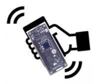
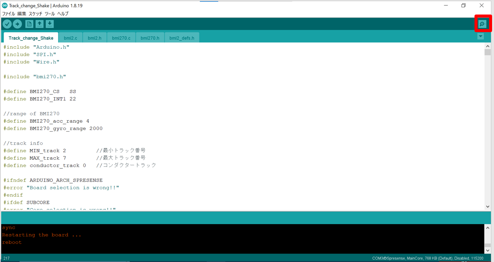

# 速く振ることによるトラック操作機能

2023年春インターンシップで作った手の動きによるトラック操作機能です。

3軸ジャイロセンサで手の動きを検出し、速く振ると再生トラックを変更することができます。

## 構成ハードウェア

* [Spresense メインボード](https://developer.sony.com/ja/develop/spresense/specifications)
* [Spresense 拡張ボード](https://developer.sony.com/ja/develop/spresense/specifications)
* [Sony Spresense 用 6軸 加速度計・ジャイロスコープセンサ (BMI270) Addon ボード](https://nextstep.official.ec/items/66165025)
* microSDHCカード
* イヤホン

## 構成ソフトウェア

* Spresense Reference Board
* [Sound Signal Processing Library for Spresense](https://github.com/SonySemiconductorSolutions/ssih-music/)
* [BMI270-Sensor-API](https://github.com/TomonobuHayakawa/BMI270-Sensor-API)

## 楽譜ファイルを用意する

サンプルスケッチMusicBoxは**フォーマット1の**MIDIファイルの再生に対応しています。
再生したいMIDIファイルをSDカードにコピーして、そのファイル名をスケッチの `ScoreSrc` に指定します。

```Track_change_Shake.ino
// 演奏する楽譜ファイルを指定します。
// フォルダを指定すると、そのフォルダの中にある楽譜ファイルを演奏します。
ScoreSrc inst("SCORE/aogeba.mid", sink);
```

MIDIファイルは販売・配布されているものを入手して使用することができます。
その場合は**利用規約、著作権、ライセンスをよく確認し順守して使用してください。**
また、**フォーマットにも十分注意してください。**

MIDIファイル配布サイトの例:
* [ぷりんと楽譜](https://www.print-gakufu.com/)
* [Wikimedia Commons](https://commons.wikimedia.org/wiki/)
    * [Category:MIDI files](https://commons.wikimedia.org/wiki/Category:MIDI_files)
        * 多数のMIDIファイルが一覧されますが、すべてのMIDIファイルが表示されているわけではありません。例えば[Flohwalzer(ノミのワルツ、猫踏んじゃった)](https://commons.wikimedia.org/wiki/Category:Flohwalzer)のMIDIファイルはこのページには列挙されていません。
* [フリーBGM Music with myuu](https://www.ne.jp/asahi/music/myuu/)

## 音源ファイルを用意する

サンプルスケッチMusicBoxはSFZ音源ファイルを使って楽譜を再生します。
演奏したいSFZ音源ファイルをSDカードにコピーして、そのファイル名をスケッチの `SFZSink` に指定します。

```Track_change_Shake.ino
// SFZ音源ファイルを指定します。
SFZSink sink("SawLpf.sfz");
```

SFZ音源ファイルは[サンプル音源](https://github.com/SonySemiconductorSolutions/ssih-music/releases/latest/download/assets.zip)(SawLpf.sfz)のほか、販売・配布されているものを入手して使用することができます。
販売・配布されているSFZ音源ファイルは、そのままでは本ライブラリで使用できない場合があるため、その場合はインポートツール[import-sfz.py](../../tools/README.md)で変換すると使用できるようになる場合があります。

このようなSFZ音源ファイルを使用する場合は**利用規約、著作権、ライセンスをよく確認し順守して使用してください。**
**インポートツールを使用した場合は音源ファイルの加工を伴うため、加工に関する条項にも注意してください。**
**また、1つのSFZ音源ファイルの中であっても、SFZファイルやWAVファイルに個別のライセンスが設定されている場合もあります。**

**音源ファイルの音域が狭い場合、正常に演奏されない場合がありますので、できるだけ広い音域の音源ファイルを使用してください。**

SFZ音源ファイル配布サイトの例:
* [Versilian Studios LLC.](https://vis.versilstudios.com/)
    * [VSCO Community](https://vis.versilstudios.com/vsco-community.html)
* [Virtual Playing Orchestra](http://virtualplaying.com/virtual-playing-orchestra/)
* [The FreePats project](https://freepats.zenvoid.org/)
* [SFZ Instruments](https://sfzinstruments.github.io/)

## トラック情報の入力

楽譜ファイル内で楽譜情報がある最小トラック番号と最大トラック番号をプログラム内に入力します。
楽譜ファイル内のトラック情報は「GarageBand」などのアプリを使用して確認してください。
**入力する際には各トラック番号から1を引いた数を入力してください。**
なお、フォーマット1のMIDIファイルでは第1トラックにテンポ情報があり、演奏時に必要な情報のため、コンダクタートラックとして設定していますので、変更は不要です。

例）最小トラック番号が3、最大トラック番号が8の場合は以下のように入力してください。

```Track_change_Shake.ino
//track info
#define MIN_track 2         //最小トラック番号
#define MAX_track 7         //最大トラック番号
#define conductor_track 0   //コンダクタートラック
```

## Spresenseの持ち方

Spresenseの持ち方は以上の図の通りです。


## 演奏方法とトラックの変更方法

演奏は以下の手順で開始します。
1. Spresenseの電源をオンにする
2. Arduino IDEのシリアルモニタのボタン（下図の赤枠で囲ったボタン）を押してシリアルモニタを起動し、パソコンのEnterボタンを押して加速度データを取得開始する
3. 一度速く振り、指定した楽譜を指定した音源で再生する
**なお、最初は以下の手の動きの応じて最小トラックから変更したトラックが演奏されます。**
例）
* 最初に速く振り下ろす場合、最小トラックの次のトラックが再生
* 最初に速く振り上げる場合、最大トラックが再生



加速度データが正常に取得されると最小トラック番号がシリアルモニタ上で約0.01秒ごとに表示されます。
最小トラック番号が1度しか表示されない場合は、Spresenseのメインボードにあるリセットボタン（LEDの左隣）を押してから、再度Enterボタンを押して加速度データを取得してください。

手の動きとトラック操作の対応関係は以下の表の通りです。
| 手の動き             | トラック操作        |
| ----                　| ----             |
| 速く振り下ろす       | 次のトラックを再生 |
| 速く振り上げる 　　　| 前のトラックを再生 |

**以下の場合は特殊な変化をするので注意してください。**
* 最小トラック演奏時に前のトラックを選択する場合、最大トラックが再生
* 最大トラック演奏時に次のトラックを選択する場合、最小トラックが再生

## 再生トラックの確認方法

再生トラックはSpresenseのLEDもしくはArduino IDEのシリアルモニタで確認できます。

### LEDでの確認方法

選択しているトラック番号を4ビットの2進数で表した際に「1」になる位置のLEDを発光させています。
例）選択トラック番号が「5」のときは、4ビットの2進数で「0101」と表せるため、SpresenseのLEDの0番と2番が発光します。

### シリアルモニタでの確認方法

シリアルモニタ上では、再生中のトラック番号が約0.01秒ごとに出力されているので、選択しているトラック番号を確認することができます。
